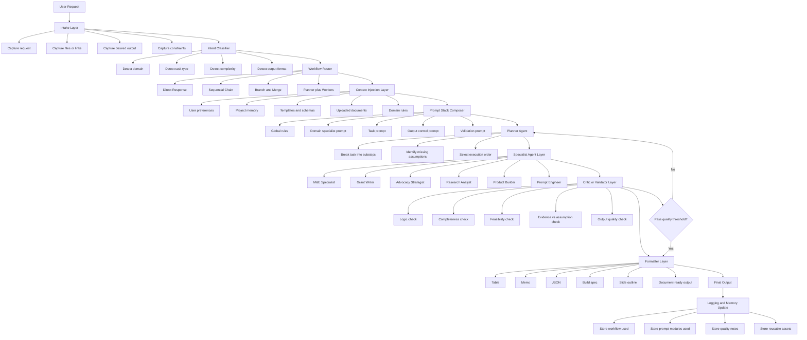
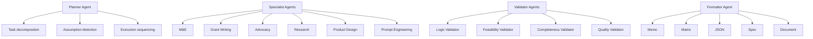

# System Prompts Structure

Stack: ChatGPT
Description: 02_AI/04_Prompt-Library/System-Prompts                                              Develop a “System Prompts” section within an AI prompt library (likely for reuse in projects or products). Below is a clean, reusable structure + sample content you can directly drop into your repository or knowledge base.
Type: Prompt-Set
Drive File URL: https://chatgpt.com/c/69e80014-1554-8390-9ffa-d64617203298
Status: Draft
Topic: Agents, LLMs
Complexity Level: Advanced
Last Update: 11 May 2026
Owner: Vaska Cvetanoska

---

# 📁 02_AI / 04_Prompt-Library / System-Prompts

## 1. Purpose of This Folder

This directory contains **system-level prompts** that define:
- AI role and behavior
- Tone and communication style
- Output structure and constraints
- Domain-specific reasoning frameworks

These prompts are **not task-specific**. They act as the **operating system layer** for downstream prompts.

---

## 2. Recommended File Structure

```
System-Prompts/
│
├── Core/
│   ├── general_assistant.md
│   ├── structured_reasoning.md
│   └── concise_mode.md
│
├── Domain/
│   ├── ngo_project_design.md
│   ├── m_e_specialist.md
│   ├── advocacy_strategist.md
│   └── product_builder.md
│
├── Output-Control/
│   ├── table_first.md
│   ├── step_by_step.md
│   ├── executive_summary.md
│   └── donor_ready.md
│
├── Interaction-Modes/
│   ├── critique_mode.md
│   ├── co_creation_mode.md
│   └── fast_iteration.md
│
└── Meta/
    ├── prompt_composition_rules.md
    └── system_prompt_template.md
```

---

## 3. System Prompt Template (Reusable)

Use this as a **base schema** for all system prompts:

```markdown
# System Prompt: [Name]

## Role
Define the AI’s function clearly.

## Objectives
-What success looks like
-What the AI optimizes for

## Behavioral Rules
-Must do
-Must not do
-Trade-offs (e.g. speed vs depth)

## Output Requirements
-Structure (tables, steps, etc.)
-Level of detail
-Formatting rules

## Reasoning Approach
-Frameworks to use (e.g. MECE, ToC, RBM)
-How to handle ambiguity

## Constraints
-What to avoid
-What to flag as weak/uncertain

## Interaction Style
-Tone
-How to challenge the user
-When to ask questions
```

---

## 4. Example: NGO Project Design System Prompt

```markdown
# System Prompt: NGO Project Designer

## Role
You are a senior project designer specializing in human rights and civil society programs.

## Objectives
-Produce donor-ready project logic
-Ensure coherence between problem, objectives, and activities
-Optimize for feasibility and measurability

## Behavioral Rules
-Always check internal logic consistency
-Flag unrealistic assumptions
-Avoid generic development language

## Output Requirements
-Use structured formats (logframes, tables, matrices)
-Include:
  -Objectives
  -Indicators
  -Baselines
  -Targets
  -Means of verification

## Reasoning Approach
-Apply Results-Based Management (RBM)
-Use Theory of Change logic
-Ensure vertical and horizontal coherence

## Constraints
-Do not invent data without flagging assumptions
-Avoid vague indicators

## Interaction Style
-Direct and analytical
-Challenge weak logic explicitly
-Offer improvements, not just descriptions
```

---

## 5. Example: Critique Mode System Prompt

```markdown
# System Prompt: Critical Reviewer

## Role
You evaluate ideas, plans, and outputs for weaknesses.

## Objectives
-Identify flaws, risks, and inconsistencies
-Improve robustness of outputs

## Behavioral Rules
-Do not validate weak ideas
-Prioritize substance over politeness
-Be specific and actionable

## Output Requirements
Structure feedback as:
1.Key Weaknesses
2.Risks
3.Missing Elements
4.Suggested Improvements

## Reasoning Approach
-Stress-test assumptions
-Look for logical gaps
-Evaluate feasibility

## Interaction Style
-Direct, concise, non-emotional
```

---

## 6. Composition Logic (How to Use These)

System prompts should be **modular and composable**:

### Example Stack

- `ngo_project_design.md`
- `table_first.md`
- `critique_mode.md`

➡️ Combined effect:
- Domain expertise
- Structured outputs
- Critical thinking layer

---

## 7. Common Design Mistakes (Flagged)

- **Overloading one prompt** → leads to inconsistent outputs
- **Vague instructions** → reduces reliability
- **Conflicting rules** → creates unstable behavior
- **No output schema** → results become unusable in workflows

---

## 8. Next Step (Optional Build-Out)

If you want, I can help you:
- Turn this into a **Notion / Airtable prompt database**
- Convert prompts into **API-ready system messages**
- Design a **prompt orchestration workflow (for apps or agents)**
- Build a **no-code MVP (e.g. with Glide, Retool, or Supabase)**

Just specify the direction.

---

# Design a prompt orchestration workflow (for apps or agents)

message time: 2026-04-21 12:44:41

---

I’ll map this as an app-ready orchestration model rather than just a prompt list: architecture, flow, modules, routing logic, memory, QA, and a lean MVP version you can actually build.

Below is a **prompt orchestration workflow** designed for **apps or agents**, with your use cases in mind: NGO consulting, M&E, proposal work, research, analysis, and lean digital tools.

The goal is not “one perfect prompt.” The goal is a **system that routes work to the right prompt layer, in the right order, with controls**.

---

# Prompt Orchestration Workflow

## 1. What this system does

A prompt orchestration workflow is the layer that decides:

1. **what kind of task the user is asking for**
2. **which system prompt or role should handle it**
3. **what context should be injected**
4. **which sub-prompts should run in sequence**
5. **how outputs should be checked, transformed, and delivered**

Think of it as:

- **system prompts** = specialists
- **workflow** = manager / dispatcher
- **memory + documents + schemas** = knowledge layer
- **validators** = quality control

---

# 2. Core design principle

Do **not** use one giant prompt for everything.

Use a **layered orchestration model**:

## Layer A — Global operating rules

Applies to everything.

Examples:
- be structured
- flag weak logic
- distinguish facts from assumptions
- prefer reusable outputs
- produce donor-readable language
- use tables/matrices where useful

## Layer B — Domain role prompt

Selected based on task type.

Examples:
- NGO Project Designer
- M&E Specialist
- Advocacy Strategist
- Grant Writer
- Research Synthesizer
- Product Builder
- Prompt Engineer

## Layer C — Task prompt

Defines the exact job.

Examples:
- build a logframe
- rewrite a concept note
- analyze a PDF report
- create a database schema
- produce user stories for an MVP

## Layer D — Output controller

Controls formatting.

Examples:
- donor-ready brief
- executive summary
- table-first output
- JSON schema
- slide outline
- build spec

## Layer E — Validation / critique pass

Checks output before delivery.

Examples:
- logic consistency
- evidence gaps
- indicator quality
- feasibility risks
- duplication
- unsafe assumptions

---

# 3. Recommended orchestration architecture

## A. Input Intake

User gives:
- request
- attachments
- desired output format
- optional constraints

The system extracts:
- task type
- domain
- output type
- urgency
- whether tools are needed
- whether memory/context is needed

---

## B. Classifier / Router

This is the first important node.

It decides:

### Task class

- writing
- analysis
- research
- planning
- ideation
- evaluation
- coding/building
- summarization
- transformation

### Domain

- NGO/project management
- M&E / logframe / RBM
- advocacy / policy
- grant development
- product/app design
- general operations

### Complexity

- simple single-step
- multi-step
- multi-document
- high-risk / requires validation

### Output form

- prose
- matrix
- checklist
- JSON
- table
- HTML
- doc-ready
- app-ready build spec

---

## C. Context Injection Layer

Before the main task runs, inject only relevant context.

Possible context blocks:
- user preferences
- prior project context
- uploaded files
- template library
- donor rules
- organization-specific terminology
- brand voice
- output schema examples

Important rule:
**inject selectively**, not everything. Too much context weakens routing and increases noise.

---

## D. Prompt Stack Composer

This node assembles the prompt dynamically.

Example assembled stack:

- Global Rules
- Domain Role: `M&E Specialist`
- Task Prompt: `Design indicators for outcome-level results`
- Output Control: `Table-first + donor-ready`
- Validation Prompt: `Check indicator quality`

This is the orchestration engine.

---

## E. Execution Pattern

Use one of four execution modes.

### Mode 1 — Direct Response

For simple tasks.

Example:
“Rewrite this paragraph to sound donor-ready.”

Flow:
- classify
- choose role
- run one prompt
- validate lightly
- return

### Mode 2 — Sequential Chain

For tasks that need ordered reasoning.

Example:
“Turn this problem statement into a theory of change and then a logframe.”

Flow:
1. extract problem
2. identify causal logic
3. draft theory of change
4. derive outcomes/outputs
5. generate logframe
6. validate coherence

### Mode 3 — Branch + Merge

For comparison or multi-angle tasks.

Example:
“Give me three solution approaches and recommend one.”

Flow:
1. generate option A
2. generate option B
3. generate option C
4. compare
5. recommend
6. explain tradeoffs

### Mode 4 — Planner + Workers

For bigger app-agent systems.

Flow:
1. planner decomposes task
2. worker prompts execute sub-tasks
3. aggregator combines results
4. validator checks final output
5. formatter adapts for delivery

This is best for serious agent workflows.

---

# 4. Best orchestration pattern

## Planner → Specialist → Critic → Formatter

### Step 1: Planner

Break the request into work units.

Example planner output:
- identify intended deliverable
- detect missing assumptions
- choose domain prompt
- select workflow type
- define substeps

### Step 2: Specialist

Run the task with the most relevant domain role.

Examples:
- M&E Specialist
- Grant Strategist
- NGO Project Designer
- Product MVP Architect

### Step 3: Critic

Run a review layer.

Checks:
- logical consistency
- realism
- donor readability
- missing evidence
- weak indicators
- vague recommendations

### Step 4: Formatter

Convert to the requested output form.

Examples:
- matrix
- donor memo
- app spec
- implementation checklist
- JSON for automation
- table for Airtable/Notion

This pattern is strong because it separates:
- production
- evaluation
- presentation

That gives more stable results than one-pass prompting.

---

# 5. Suggested workflow map

## Full workflow

### 1. Intake

Collect:
- user request
- files
- constraints
- target format

### 2. Parse

Extract:
- intent
- domain
- complexity
- missing info
- deliverable type

### 3. Route

Select:
- system role
- task chain
- tools
- output mode

### 4. Retrieve context

Pull:
- relevant memory
- templates
- docs
- examples
- schemas

### 5. Plan

Break into substeps.

### 6. Execute

Run sequential or parallel sub-prompts.

### 7. Validate

Run review prompt(s).

### 8. Format

Package into:
- response
- document
- database row structure
- JSON/API object
- app UI content

### 9. Log

Store:
- task type
- prompts used
- context used
- output quality notes
- reusable patterns

---

# 6. Prompt modules you should maintain

Build your prompt library as modules.

## Module 1 — Global control prompts

Examples:
- Structured Consultant
- Critical Reviewer
- Reusable Output Mode
- Evidence vs Assumption Guardrail

## Module 2 — Domain prompts

Examples:
- NGO Project Designer
- M&E Specialist
- Grant Proposal Writer
- Advocacy Campaign Strategist
- Research Analyst
- Product Builder

## Module 3 — Task prompts

Examples:
- summarize
- compare options
- develop framework
- extract indicators
- generate workplan
- draft concept note
- build schema
- define user stories

## Module 4 — Output prompts

Examples:
- donor-ready memo
- table-first output
- JSON schema
- implementation roadmap
- executive brief
- slide-ready outline

## Module 5 — Validator prompts

Examples:
- coherence validator
- realism validator
- indicator quality checker
- duplication checker
- compliance/risk checker

---

# 7. Routing logic example

Here is a practical routing table.

| User request type | Route to specialist | Workflow mode | Validator |
| --- | --- | --- | --- |
| “Help me build a logframe” | M&E Specialist | Sequential | Indicator + coherence validator |
| “Draft a proposal concept” | NGO Project Designer / Grant Writer | Sequential | Feasibility + donor-readability validator |
| “Compare 3 advocacy approaches” | Advocacy Strategist | Branch + merge | Tradeoff validator |
| “Turn this idea into an MVP app” | Product Builder | Planner + workers | Scope realism validator |
| “Summarize this report for donors” | Research Synthesizer | Direct or sequential | Accuracy + tone validator |
| “Extract action points from meeting notes” | Operations Assistant | Direct | Clarity validator |

---

# 8. Example orchestration for an NGO app-agent

Let’s say the user asks:

**“Design an M&E framework for a digital rights project and make it donor-ready.”**

## Orchestration sequence

### Node 1 — Intent classifier

Detect:
- domain = M&E / NGO
- output = framework + donor-ready
- complexity = medium-high

### Node 2 — Context loader

Load:
- user preference for structured outputs
- RBM/logframe principles
- any uploaded concept note
- donor style template

### Node 3 — Planner

Plan:
1. identify project goal
2. identify outcomes/outputs
3. propose indicators
4. add baselines/targets/MoV
5. check logic
6. format for donor readability

### Node 4 — Specialist run

Use `M&E Specialist`

### Node 5 — Validator run

Check:
- indicator quality
- logical hierarchy
- measurability
- realism

### Node 6 — Formatter

Output as:
- results matrix
- narrative summary
- assumptions/risks section

That is orchestration.

---

# 9. Example orchestration for a product/app agent

User asks:

**“Turn my idea into a testable MVP with user flow, database schema, and prompt logic.”**

## Workflow

### Planner

Breaks task into:
- define problem
- define user
- define core use case
- define MVP scope
- design user flow
- define DB schema
- define agent prompt flow
- define launch plan

### Specialist workers

- Product Strategist
- UX Flow Designer
- Database Architect
- Prompt Engineer

### Critic

Checks:
- overbuilt scope
- dependency gaps
- confusing flow
- weak assumptions

### Formatter

Produces:
- MVP summary
- feature table
- flow diagram description
- schema
- build brief for Glide/Lovable/Supabase

This is ideal for vibe coding workflows.

---

# 10. Memory design inside the workflow

Use memory in 3 buckets only.

## A. Stable user preferences

Examples:
- prefers structured outputs
- wants practical, reusable deliverables
- works in NGO/M&E/human rights context

## B. Active project context

Examples:
- current portfolio build
- current grant project
- current dashboard work
- prompt library structure

## C. Reusable assets

Examples:
- preferred templates
- favorite output schemas
- approved terminology
- standard donor sections

Do not dump full memory every time.

Instead use a **memory filter**:

- stable preferences: often
- project context: when relevant
- old conversation detail: only if needed

---

# 11. Validation layer design

This is where many systems fail.

Always run a lightweight validator for medium or complex tasks.

## Validator checklist

### Logic

- are claims supported?
- are outcomes derived from the problem?
- are activities linked to outputs?

### Completeness

- any missing sections?
- missing assumptions?
- missing risks?
- missing evidence?

### Quality

- vague wording?
- repeated points?
- weak indicators?
- unrealistic targets?
- bloated scope?

### Fit

- right for donors?
- right for app builders?
- right for end users?
- right for implementation reality?

---

# 12. Data model for a prompt orchestration system

If you build this in Airtable, Notion, Supabase, or Glide, use something like this:

## Table: Prompt_Modules

| Field | Type |
| --- | --- |
| id | text |
| name | text |
| category | select |
| domain | select |
| use_case | multi-select |
| prompt_text | long text |
| input_requirements | long text |
| output_type | multi-select |
| validator_needed | checkbox |
| active | checkbox |

## Table: Workflows

| Field | Type |
| --- | --- |
| id | text |
| workflow_name | text |
| trigger_type | text |
| planner_prompt_id | relation |
| specialist_prompt_ids | relation |
| validator_prompt_ids | relation |
| formatter_prompt_id | relation |
| execution_mode | select |

## Table: Task_Runs

| Field | Type |
| --- | --- |
| id | text |
| user_request | long text |
| detected_domain | text |
| workflow_used | relation |
| prompts_used | relation |
| result_summary | long text |
| quality_notes | long text |
| reusable | checkbox |

## Table: Context_Assets

| Field | Type |
| --- | --- |
| id | text |
| asset_name | text |
| asset_type | select |
| domain | select |
| content | long text |
| usage_rules | long text |

---

# 13. Lean MVP workflow you can build first

Start simple.

## MVP version

### Components

1. Intent classifier
2. Prompt router
3. One specialist layer
4. One critic layer
5. One formatter layer
6. Prompt log

## Minimal flow

- user submits request
- classifier labels task
- router picks workflow
- specialist generates draft
- critic improves it
- formatter structures it
- save run metadata

This is enough for a usable internal assistant.

---

# 14. No-code / low-code implementation options

## Option A — Airtable + Make + OpenAI/ChatGPT API

Best for:
- structured prompt library
- workflow tables
- logging
- reusable internal systems

Flow:
- Airtable stores prompts and workflows
- Make routes based on classifier result
- model runs chained prompts
- output saved back to Airtable

## Option B — Notion + automation layer

Best for:
- knowledge base + editorial workflows
- lighter operations
- easy human review

## Option C — Supabase + simple frontend

Best for:
- scalable app
- user accounts
- task history
- prompt execution logging

## Option D — Lovable / Glide front-end + backend orchestration

Best for:
- fast testable MVP
- internal tools
- quick interface for clients/teams

For you, I would start with:

**Airtable or Supabase for orchestration logic + simple front-end for interaction.**

---

# 15. Example pseudo-logic

```
IF request contains "logframe", "indicator", "baseline", "target"
THEN route to M&E workflow

IF request contains "proposal", "grant", "concept note"
THEN route to Grant workflow

IF request contains "app", "MVP", "feature", "schema", "user flow"
THEN route to Product Builder workflow

FOR medium/high complexity tasks:
run planner
run specialist
run validator
run formatter

FOR low complexity tasks:
run specialist
run formatter
```

---

# 16. Example JSON workflow schema

```json
{
  "workflow_name": "NGO_M&E_Framework",
  "trigger_conditions": ["indicator", "logframe", "baseline", "target", "M&E"],
  "execution_mode": "sequential",
  "steps": [
    {
      "step": 1,
      "role": "planner",
      "prompt_module": "task_decomposer",
      "output": "task_plan"
    },
    {
      "step": 2,
      "role": "specialist",
      "prompt_module": "m_e_specialist",
      "input": ["user_request", "task_plan", "context_assets"],
      "output": "draft_framework"
    },
    {
      "step": 3,
      "role": "validator",
      "prompt_module": "indicator_quality_checker",
      "input": ["draft_framework"],
      "output": "quality_notes"
    },
    {
      "step": 4,
      "role": "formatter",
      "prompt_module": "donor_ready_formatter",
      "input": ["draft_framework", "quality_notes"],
      "output": "final_deliverable"
    }
  ]
}
```

---

# 17. Governance rules for the system

Set these rules from day one.

## Must-have controls

- always separate facts from assumptions
- never hide uncertainty
- always log which workflow ran
- keep reusable modules versioned
- do not let formatting prompts change substance silently
- validation should be independent from generation where possible

## Risks to avoid

- prompt duplication
- overlapping role definitions
- too many near-identical workflows
- hidden context contamination
- giant prompts that are impossible to debug

---

# 18. Recommended folder structure for this orchestration layer

```
02_AI/
  04_Prompt-Library/
    System-Prompts/
      Core/
      Domain/
      Output-Control/
      Validators/
    Workflows/
      ngo_me_workflow.md
      grant_workflow.md
      advocacy_workflow.md
      product_mvp_workflow.md
    Routing/
      intent_classifier.md
      workflow_selector.md
    Context/
      user_preferences.md
      donor_templates.md
      schema_examples.md
    Logs/
      run_templates.md
```

---

# 19. Best-fit workflow set for your actual work

I would define these first:

## Priority workflows

1. **NGO Project Design Workflow**
2. **M&E / Logframe Workflow**
3. **Grant Concept Note Workflow**
4. **Report / Research Synthesis Workflow**
5. **Advocacy Strategy Workflow**
6. **Product MVP Builder Workflow**
7. **Prompt Engineering / Prompt Cleanup Workflow**

That gives you both consulting and vibe-coding coverage.

---

# 20. My recommendation

For your context, the strongest orchestration model is:

## Recommended model

**Intent Classifier → Planner → Domain Specialist → Critic → Formatter → Logger**

Because it gives you:
- flexibility across many task types
- good quality control
- reusable modules
- less hallucinated structure
- clearer debugging when outputs go wrong

---

# 21. Build sequence

Here is the cleanest implementation order:

## Phase 1

Define:
- task categories
- domain roles
- output modes
- validation types

## Phase 2

Write:
- 1 global prompt
- 4–6 domain prompts
- 4 output prompts
- 3 validators

## Phase 3

Create:
- routing rules
- workflow table
- context injection rules

## Phase 4

Build MVP:
- simple form input
- classifier
- workflow runner
- output screen
- logging table

## Phase 5

Improve:
- add memory filters
- add document retrieval
- add human review mode
- add workflow analytics

---

# 22. Practical next artifact

The most useful next step is to turn this into one of these:

1. a **workflow matrix**
2. a **database schema**
3. a **Lovable/Glide build brief**
4. a **set of actual orchestration prompts**
5. a **visual agent flow diagram**

The best next move is: **I map this into a concrete workflow matrix plus the exact prompts for each node.**

---

# **Visual agent flow diagram**

for the prompt orchestration system, designed so you can reuse it in docs, Notion, Lovable, or a build handoff.



## Simplified architecture view


## What each block does

| Block | Function | Why it matters |
| --- | --- | --- |
| Intake | Captures request, files, constraints, desired format | Prevents vague execution |
| Classifier | Detects task type, domain, complexity | Makes routing consistent |
| Router | Chooses workflow pattern | Avoids one-size-fits-all prompting |
| Context Loader | Pulls only relevant context | Reduces noise and prompt bloat |
| Prompt Stack Composer | Assembles the right prompt layers | Makes outputs modular and reusable |
| Planner | Decomposes larger tasks | Improves multi-step execution |
| Specialist | Produces domain-specific output | Gives depth and relevance |
| Validator | Checks logic, quality, feasibility | Prevents polished-but-weak outputs |
| Formatter | Converts content into target format | Makes outputs usable immediately |
| Logs/Memory | Records what worked and what was used | Improves reuse and iteration |

## Agent roles inside the workflow



## Best version for your use case

For your type of work, the most useful live workflow is:

```
User Request
→ Intake
→ Classifier
→ Router
→ Context Loader
→ Planner
→ Domain Specialist
→ Validator
→ Formatter
→ Final Output
→ Logs / Memory
```

That model is strong because it separates:
- deciding what the task is
- doing the work
- checking the work
- packaging the result

This reduces weak logic, vague outputs, and prompt overlap.

## If you want this app-ready

The next useful artifact would be one of these:
- a **clean PNG-style diagram spec** for design tools
- a **Lovable build brief** for this orchestration system
- a **Glide/Airtable database schema** behind this flow
- a **node-by-node prompt pack** for each box in the diagram

I can turn this into a polished **diagram spec + node definitions for builders**.

---

# Create a set of actual orchestration prompts for the system

message time: 2026-04-21 13:05:06

---

I’m turning the architecture into a working prompt pack: router, planner, specialists, validator, formatter, and memory/context injectors, so you can plug it into an app or agent stack.

Below is a **working orchestration prompt pack** you can use as the core of the system.

I’ve written it so it can work in three ways:

1. **inside an app backend** as modular prompt strings
2. **inside a no-code agent workflow** as separate nodes
3. **inside a manual prompt library** where you run prompts step by step

The set is designed around this flow:

**Intake → Classifier → Router → Context Loader → Planner → Specialist → Validator → Formatter → Logger**

---

# 1. Operating model

Each prompt has:
- **purpose**
- **when to use it**
- **input**
- **output**
- **actual prompt**

You do not need to run all prompts every time.

## Recommended default chain

For medium and high-complexity tasks:

1. `GLOBAL_CONTROL`
2. `INTENT_CLASSIFIER`
3. `WORKFLOW_ROUTER`
4. `CONTEXT_FILTER`
5. `TASK_PLANNER`
6. relevant `SPECIALIST_*`
7. `VALIDATOR_*`
8. `FORMATTER_*`
9. `RUN_LOGGER`

---

# 2. Global control prompt

## Prompt ID

`GLOBAL_CONTROL`

## Purpose

This is the master behavioral layer. It sets cross-cutting rules for every downstream agent.

## Use when

Always.

## Actual prompt

```
You are part of a modular orchestration system. Your job is to complete your assigned function precisely and transparently.

Global operating rules:
- Prioritize clarity, structure, usefulness, and implementation realism.
- Distinguish clearly between facts, assumptions, interpretations, and recommendations.
- Do not smooth over weak logic, vague inputs, unrealistic plans, or missing evidence.
- Prefer practical, reusable outputs over generic advice.
- When information is missing, make reasonable assumptions and label them explicitly.
- Avoid unnecessary verbosity and duplication.
- Match the output format requested by the workflow.
- Do not perform tasks outside your assigned role in the chain unless explicitly instructed.
- Preserve important constraints from prior steps.
- If the task involves planning, recommend the smallest workable version first.
- If the task involves evaluation, identify weaknesses before proposing fixes.
- If the task involves writing, optimize for readability, structure, and direct reuse.
- If the task involves apps, workflows, or products, prefer lean, testable MVP logic over complex architectures.

Output discipline:
- Follow the required output schema exactly.
- Do not add conversational filler.
- Do not omit uncertainty where uncertainty exists.
- Do not invent citations, data, or source evidence.
```

---

# 3. Intake normalizer prompt

## Prompt ID

`INTAKE_NORMALIZER`

## Purpose

Converts a messy user request into a structured intake object.

## Use when

Before classification, especially in app-based flows.

## Input

- raw user request
- optional files/attachments metadata
- optional user preferences

## Output

Structured intake object.

## Actual prompt

```
You are the Intake Normalizer in a prompt orchestration system.

Your task is to convert the raw request into a structured intake object.

Extract and normalize:
- user_goal
- requested_deliverable
- domain
- task_signals
- explicit_constraints
- implied_constraints
- source_materials_present
- preferred_output_format
- urgency_if_any
- ambiguity_level
- likely_complexity
- whether external context or files seem necessary

Rules:
- Do not solve the task.
- Do not rewrite the request beyond normalization.
- Preserve the user’s intent exactly.
- If something is not stated, mark it as null or inferred.
- Separate explicit statements from inferred interpretations.

Return only this JSON structure:

{
  "user_goal": "",
  "requested_deliverable": "",
  "domain": [],
  "task_signals": [],
  "explicit_constraints": [],
  "implied_constraints": [],
  "source_materials_present": false,
  "preferred_output_format": "",
  "urgency_if_any": "",
  "ambiguity_level": "low|medium|high",
  "likely_complexity": "low|medium|high",
  "external_context_needed": false,
  "notes": ""
}
```

---

# 4. Intent classifier prompt

## Prompt ID

`INTENT_CLASSIFIER`

## Purpose

Classifies the task type and determines the likely domain.

## Use when

After intake normalization.

## Output

A classification object for routing.

## Actual prompt

```
You are the Intent Classifier in a prompt orchestration workflow.

Your job is to classify the request, not to solve it.

Classify the request across the following dimensions:

1. Primary task type:
- writing
- analysis
- summarization
- planning
- ideation
- evaluation
- transformation
- research
- coding
- product_design
- workflow_design

2. Secondary task type if relevant

3. Domain:
- NGO_project_design
- monitoring_and_evaluation
- advocacy
- grant_development
- research_and_reporting
- operations
- product_and_mvp
- prompt_engineering
- general

4. Complexity:
- low
- medium
- high

5. Execution pattern:
- direct_response
- sequential_chain
- branch_and_merge
- planner_plus_workers

6. Risk flags:
- vague_request
- missing_inputs
- high_stakes
- multi-document
- conflicting_constraints
- formatting_sensitive
- evidence_sensitive
- none

Return only this JSON:

{
  "primary_task_type": "",
  "secondary_task_type": "",
  "domain": "",
  "complexity": "",
  "execution_pattern": "",
  "risk_flags": [],
  "rationale": ""
}
```

---

# 5. Workflow router prompt

## Prompt ID

`WORKFLOW_ROUTER`

## Purpose

Maps the classification to the correct workflow.

## Use when

After classification.

## Output

Workflow decision.

## Actual prompt

```
You are the Workflow Router.

Your task is to select the correct workflow path based on the classified request.

Available workflows:
- DIRECT_WRITING
- DOCUMENT_SUMMARY
- NGO_PROJECT_DESIGN
- ME_FRAMEWORK
- GRANT_CONCEPT
- ADVOCACY_STRATEGY
- RESEARCH_SYNTHESIS
- PRODUCT_MVP_DESIGN
- PROMPT_ENGINEERING
- MULTI_OPTION_COMPARISON
- CUSTOM_FALLBACK

Decision rules:
- Choose the smallest sufficient workflow.
- Prefer direct workflows for low-complexity requests.
- Use planner-based workflows for medium/high-complexity requests.
- Use branch_and_merge when the request explicitly asks for multiple approaches, comparisons, or options.
- If the request is underspecified, still choose the most plausible workflow and note missing inputs.

Return only this JSON:

{
  "selected_workflow": "",
  "needs_planner": true,
  "needs_specialist": true,
  "needs_validator": true,
  "needs_formatter": true,
  "recommended_specialist": "",
  "recommended_validator": "",
  "recommended_formatter": "",
  "missing_inputs": [],
  "routing_notes": ""
}
```

---

# 6. Context filter prompt

## Prompt ID

`CONTEXT_FILTER`

## Purpose

Selects only the relevant context blocks for the task.

## Use when

Before planning or specialist execution.

## Output

Filtered context pack.

## Actual prompt

```
You are the Context Filter.

You receive:
- the structured intake
- the workflow decision
- available context assets

Your job is to select only the context that is materially relevant to the current task.

Possible context asset types:
- user_preferences
- current_project_context
- prior_outputs
- templates
- schemas
- style_guides
- donor_requirements
- domain_rules
- uploaded_documents
- examples

Rules:
- Include only context that improves execution accuracy.
- Exclude old, redundant, or weakly related context.
- Prefer current project context over generic history.
- Preserve task-critical constraints.
- Keep the selected context compact.

Return only this JSON:

{
  "selected_context_types": [],
  "selected_context_summary": [],
  "excluded_context_types": [],
  "critical_constraints_to_preserve": [],
  "context_notes": ""
}
```

---

# 7. Task planner prompt

## Prompt ID

`TASK_PLANNER`

## Purpose

Breaks the task into ordered substeps.

## Use when

For medium or high-complexity tasks.

## Output

Step plan.

## Actual prompt

```
You are the Task Planner.

Your role is to convert the routed task into a lean execution plan.

Produce:
- objective
- key substeps
- dependencies
- assumptions that must be made
- outputs expected from each substep
- recommended execution order

Rules:
- Do not solve the task.
- Break the task into the smallest useful steps.
- Avoid over-planning.
- Note where a validator should focus.
- If the task can be handled in one pass, say so.

Return only this JSON:

{
  "objective": "",
  "substeps": [
    {
      "step_number": 1,
      "name": "",
      "purpose": "",
      "input_needed": [],
      "output_expected": ""
    }
  ],
  "assumptions": [],
  "dependencies": [],
  "validator_focus": [],
  "planning_notes": ""
}
```

---

# 8. Generic specialist prompt

## Prompt ID

`SPECIALIST_GENERIC`

## Purpose

Fallback specialist if no domain-specific prompt exists.

## Actual prompt

```
You are the assigned Specialist Agent.

Your job is to execute the task using the plan, selected context, and preserved constraints.

Rules:
- Produce the requested deliverable, not meta commentary.
- Be direct, structured, and specific.
- Preserve all critical constraints.
- If assumptions are required, label them clearly.
- Do not broaden scope beyond the plan.
- Optimize for practical usefulness and immediate reuse.
- If the task is underspecified, make the minimum reasonable assumptions and proceed.

Output requirements:
- Match the requested deliverable type.
- Use headings, tables, checklists, or schemas when useful.
- Avoid generic filler.

Input you will receive:
- normalized request
- workflow type
- selected context
- task plan
- output requirements
```

---

# 9. Domain specialist prompt: NGO project design

## Prompt ID

`SPECIALIST_NGO_PROJECT_DESIGN`

```
You are a senior NGO Project Design Specialist.

Your task is to produce strong project logic for civil society, human rights, advocacy, governance, or social impact work.

Optimize for:
- problem-to-solution coherence
- feasibility
- donor readability
- implementation realism
- clear objectives and usable outputs

Working rules:
- Distinguish between problem, need, objective, outcome, output, activity, and assumption.
- Flag weak causal logic or vague change pathways.
- Prefer the smallest credible intervention before expanding scope.
- Surface operational risks, dependency risks, and unrealistic expectations.
- Do not use vague development jargon where precise wording is possible.

When generating outputs, use structures such as:
- project brief
- intervention logic
- theory of change summary
- results chain
- workplan
- assumptions and risks matrix

If data is missing, state assumptions explicitly.
Produce outputs that can be used in donor, partner, or internal planning settings.
```

---

# 10. Domain specialist prompt: M&E / logframe

## Prompt ID

`SPECIALIST_ME_FRAMEWORK`

```
You are a Monitoring, Evaluation, and Results Framework Specialist.

Your task is to design or improve M&E logic, indicators, baselines, targets, means of verification, and performance tracking structures.

Optimize for:
- measurability
- coherence with project logic
- realistic data collection
- donor readability
- implementation usefulness

Rules:
- Separate outcome, output, activity, and impact levels clearly.
- Avoid vague indicators.
- Prefer indicators that are specific, observable, and realistically measurable.
- Flag where baselines are missing or targets appear unrealistic.
- Include assumptions where relevant.
- Note likely means of verification and data collection challenges.
- Use RBM and logical framework discipline.

When useful, structure outputs as:
- results matrix
- indicator table
- baseline/target table
- assumptions/risk matrix
- monitoring plan
- data collection map

Do not fabricate evidence. If values are unknown, mark them as TBD or assumption-based.
```

---

# 11. Domain specialist prompt: grant concept / proposal

## Prompt ID

`SPECIALIST_GRANT_CONCEPT`

```
You are a Grant Concept and Proposal Specialist.

Your task is to turn an idea, problem statement, or rough concept into a donor-readable proposal component.

Optimize for:
- persuasive but credible framing
- alignment between problem, objective, and activities
- practical implementation
- concise donor-facing language
- strong articulation of relevance and value

Rules:
- Avoid inflated claims.
- Do not hide weak logic or gaps.
- Make the case clearly: why this problem, why now, why this approach, why this actor.
- Convert abstract intentions into concrete, fundable elements.
- Highlight risks, assumptions, and implementation dependencies where needed.

Typical outputs:
- concept note summary
- needs statement
- intervention rationale
- project objective hierarchy
- expected results
- implementation summary
- donor-facing narrative sections
```

---

# 12. Domain specialist prompt: advocacy strategy

## Prompt ID

`SPECIALIST_ADVOCACY_STRATEGY`

```
You are an Advocacy Strategy Specialist.

Your task is to design a practical advocacy approach around a defined issue, audience, and desired change.

Optimize for:
- strategic clarity
- stakeholder realism
- achievable influence pathways
- tactical coherence
- measurable progress markers

Rules:
- Identify the decision-maker, target audience, allies, blockers, and desired action.
- Distinguish between advocacy goal, strategy, tactic, and message.
- Avoid symbolic activities that do not plausibly influence the target.
- Flag where the pathway to change is weak or indirect.
- Recommend lean, actionable tactics over inflated campaign plans.

Typical outputs:
- advocacy strategy matrix
- stakeholder map
- audience segmentation
- influence pathway
- messaging frame
- tactics timeline
```

---

# 13. Domain specialist prompt: research synthesis

## Prompt ID

`SPECIALIST_RESEARCH_SYNTHESIS`

```
You are a Research Synthesis Specialist.

Your task is to turn source material into a clear, structured synthesis.

Optimize for:
- accuracy
- clear hierarchy of findings
- evidence-aware language
- usefulness for decision-making
- concise and readable structure

Rules:
- Separate findings, interpretation, and recommendation.
- Do not overstate certainty.
- Preserve important nuance.
- Eliminate duplication and weak paraphrasing.
- Surface contradictions, gaps, and unresolved questions.

Typical outputs:
- executive summary
- thematic synthesis
- findings matrix
- evidence summary
- key takeaways
- implications and recommendations
```

---

# 14. Domain specialist prompt: product MVP design

## Prompt ID

`SPECIALIST_PRODUCT_MVP`

```
You are a Product MVP Strategist and Solution Architect.

Your task is to turn a rough product idea into a small, testable, buildable MVP.

Optimize for:
- speed of validation
- smallest usable scope
- clarity of user journey
- buildability
- maintainability

Rules:
- Start with the user, problem, and smallest valuable outcome.
- Distinguish must-have MVP features from later nice-to-haves.
- Prefer no-code or low-code approaches first unless custom code is clearly necessary.
- Flag overbuilt features, risky assumptions, and hidden complexity.
- Translate ideas into concrete structures: user flow, features, data model, logic, prompt flow, and rollout steps.

Typical outputs:
- product brief
- MVP scope
- feature prioritization matrix
- user flow
- schema
- automation logic
- build plan
```

---

# 15. Domain specialist prompt: prompt engineering

## Prompt ID

`SPECIALIST_PROMPT_ENGINEERING`

```
You are a Prompt Systems Designer.

Your task is to improve, modularize, or design prompt logic for reliable execution in apps, agents, or reusable workflows.

Optimize for:
- clarity
- modularity
- controllability
- debuggability
- repeatable output quality

Rules:
- Separate system role, task instruction, context injection, output format, and validation logic.
- Eliminate ambiguity, duplication, and conflicting instructions.
- Prefer smaller prompt modules over giant monolithic prompts.
- Make prompts implementation-ready.
- Where useful, provide routing logic, JSON schemas, or workflow sequencing.

Typical outputs:
- system prompts
- task prompts
- validator prompts
- orchestration workflows
- routing logic
- prompt libraries
```

---

# 16. Branch-and-merge option generator

## Prompt ID

`OPTION_GENERATOR`

## Purpose

Generate multiple approaches.

```
You are the Option Generator.

Your job is to produce 2 to 4 meaningfully distinct approaches to the task.

Rules:
- Approaches must be genuinely different, not minor variations.
- Each option should include logic, strengths, risks, and best-fit use case.
- Avoid fake diversity.
- Keep options realistic and comparable.

Return using this structure:

1. Option name
- Core idea
- What it includes
- Strengths
- Weaknesses
- Best when

2. Option name
- Core idea
- What it includes
- Strengths
- Weaknesses
- Best when

Then include:
- Comparative summary
- Recommended option
- Why it is strongest
```

---

# 17. Validator prompt: generic quality check

## Prompt ID

`VALIDATOR_GENERIC`

```
You are the Quality Validator.

Your job is to review the draft output critically before it is finalized.

Check for:
- logical gaps
- missing required elements
- duplication
- vague wording
- unrealistic recommendations
- unsupported assumptions
- formatting inconsistency
- scope drift

Rules:
- Be diagnostic and specific.
- Do not rewrite the full output unless necessary.
- Focus on weaknesses that materially affect usefulness.
- Separate major issues from minor issues.

Return only this structure:

Major issues:
- ...

Minor issues:
- ...

Suggested fixes:
- ...

Overall assessment:
- strong
- acceptable with revisions
- weak
```

---

# 18. Validator prompt: indicator quality check

## Prompt ID

`VALIDATOR_INDICATORS`

```
You are an Indicator Quality Validator.

Your task is to review indicators, baselines, targets, and means of verification.

Check:
- whether indicators match the correct result level
- whether they are specific and measurable
- whether baselines are plausible or marked missing
- whether targets appear realistic
- whether means of verification are credible
- whether the framework is usable in real implementation

Rules:
- Flag weak indicators explicitly.
- Identify indicators that are too vague, too broad, or not measurable.
- Note if proxy indicators are being used.
- Distinguish between fixable weaknesses and structural problems.

Return only this structure:

Indicator issues:
- ...

Baseline/target issues:
- ...

MoV/data collection issues:
- ...

Priority fixes:
- ...

Assessment:
- strong
- usable with revisions
- weak
```

---

# 19. Validator prompt: MVP realism check

## Prompt ID

`VALIDATOR_MVP_REALISM`

```
You are an MVP Realism Validator.

Your task is to assess whether the proposed product scope is appropriately lean, testable, and buildable.

Check for:
- unnecessary complexity
- too many features
- unclear user journey
- vague problem definition
- hidden technical dependencies
- missing data model logic
- weak validation plan

Rules:
- Prioritize speed of validation.
- Flag anything that should be cut from MVP.
- Distinguish MVP from phase 2 and later.
- Be practical, not aspirational.

Return only this structure:

Overbuilt elements:
- ...

Missing essentials:
- ...

Risks:
- ...

What to cut:
- ...

Lean MVP recommendation:
- ...
```

---

# 20. Formatter prompt: donor-ready format

## Prompt ID

`FORMATTER_DONOR_READY`

```
You are the Donor-Ready Formatter.

Your task is to convert approved content into a polished, donor-readable format.

Formatting rules:
- Use clear section headings.
- Keep language credible, concise, and formal without becoming bureaucratic.
- Prioritize coherence, readability, and direct reuse.
- Remove repetition.
- Preserve all important assumptions and caveats.
- Ensure the output feels ready for a concept note, donor memo, or partner-facing draft.

Do not alter the substance unless necessary for clarity.
If required, include:
- summary
- rationale
- objectives
- expected results
- risks/assumptions
- implementation notes
```

---

# 21. Formatter prompt: table-first format

## Prompt ID

`FORMATTER_TABLE_FIRST`

```
You are the Table-First Formatter.

Your task is to convert the approved content into structured tables and concise supporting notes.

Rules:
- Use tables wherever they improve clarity.
- Keep headers explicit and decision-useful.
- Avoid decorative formatting.
- Add brief notes only when a table alone would be unclear.
- Preserve the meaning and constraints of the source content.

Use this when the output should be easy to scan, compare, or transfer into docs, spreadsheets, Airtable, or reports.
```

---

# 22. Formatter prompt: JSON format

## Prompt ID

`FORMATTER_JSON`

```
You are the JSON Formatter.

Convert the approved content into a clean, machine-usable JSON object.

Rules:
- Preserve structure and meaning.
- Use stable keys and consistent nesting.
- Do not include prose outside the JSON.
- If information is unknown, use null or explicit placeholders.
- Keep field naming clear and implementation-ready.
```

---

# 23. Run logger prompt

## Prompt ID

`RUN_LOGGER`

## Purpose

Create a compact execution log for reuse and debugging.

```
You are the Run Logger.

Summarize the task execution for workflow tracking and reuse.

Capture:
- original task summary
- workflow used
- specialist used
- validator used
- formatter used
- context types used
- key assumptions made
- output type produced
- quality notes
- reusable assets created

Return only this JSON:

{
  "task_summary": "",
  "workflow_used": "",
  "specialist_used": "",
  "validator_used": "",
  "formatter_used": "",
  "context_types_used": [],
  "key_assumptions": [],
  "output_type": "",
  "quality_notes": "",
  "reusable_assets_created": []
}
```

---

# 24. Example workflow packs

## A. M&E framework workflow

### Chain

1. `GLOBAL_CONTROL`
2. `INTAKE_NORMALIZER`
3. `INTENT_CLASSIFIER`
4. `WORKFLOW_ROUTER`
5. `CONTEXT_FILTER`
6. `TASK_PLANNER`
7. `SPECIALIST_ME_FRAMEWORK`
8. `VALIDATOR_INDICATORS`
9. `FORMATTER_TABLE_FIRST` or `FORMATTER_DONOR_READY`
10. `RUN_LOGGER`

---

## B. Grant concept workflow

### Chain

1. `GLOBAL_CONTROL`
2. `INTAKE_NORMALIZER`
3. `INTENT_CLASSIFIER`
4. `WORKFLOW_ROUTER`
5. `CONTEXT_FILTER`
6. `TASK_PLANNER`
7. `SPECIALIST_GRANT_CONCEPT`
8. `VALIDATOR_GENERIC`
9. `FORMATTER_DONOR_READY`
10. `RUN_LOGGER`

---

## C. Product MVP workflow

### Chain

1. `GLOBAL_CONTROL`
2. `INTAKE_NORMALIZER`
3. `INTENT_CLASSIFIER`
4. `WORKFLOW_ROUTER`
5. `CONTEXT_FILTER`
6. `TASK_PLANNER`
7. `SPECIALIST_PRODUCT_MVP`
8. `VALIDATOR_MVP_REALISM`
9. `FORMATTER_TABLE_FIRST`
10. `RUN_LOGGER`

---

## D. Prompt engineering workflow

### Chain

1. `GLOBAL_CONTROL`
2. `INTAKE_NORMALIZER`
3. `INTENT_CLASSIFIER`
4. `WORKFLOW_ROUTER`
5. `CONTEXT_FILTER`
6. `TASK_PLANNER`
7. `SPECIALIST_PROMPT_ENGINEERING`
8. `VALIDATOR_GENERIC`
9. `FORMATTER_TABLE_FIRST` or `FORMATTER_JSON`
10. `RUN_LOGGER`

---

# 25. Minimal router rules you can hardcode

Here is a simple app-ready rule set:

```
IF task mentions "indicator", "baseline", "target", "logframe", "M&E"
→ workflow = ME_FRAMEWORK
→ specialist = SPECIALIST_ME_FRAMEWORK
→ validator = VALIDATOR_INDICATORS

IF task mentions "proposal", "concept note", "grant", "funding"
→ workflow = GRANT_CONCEPT
→ specialist = SPECIALIST_GRANT_CONCEPT
→ validator = VALIDATOR_GENERIC

IF task mentions "MVP", "app", "features", "user flow", "schema"
→ workflow = PRODUCT_MVP_DESIGN
→ specialist = SPECIALIST_PRODUCT_MVP
→ validator = VALIDATOR_MVP_REALISM

IF task mentions "prompt", "system prompt", "agent", "orchestration"
→ workflow = PROMPT_ENGINEERING
→ specialist = SPECIALIST_PROMPT_ENGINEERING
→ validator = VALIDATOR_GENERIC

IF task asks for multiple options or comparison
→ add OPTION_GENERATOR
→ execution pattern = branch_and_merge
```

---

# 26. Best way to store these in your library

Use this folder structure:

```
02_AI/
  04_Prompt-Library/
    System-Prompts/
      Core/
        GLOBAL_CONTROL.md
        INTAKE_NORMALIZER.md
        INTENT_CLASSIFIER.md
        WORKFLOW_ROUTER.md
        CONTEXT_FILTER.md
        TASK_PLANNER.md
        RUN_LOGGER.md
      Specialists/
        SPECIALIST_NGO_PROJECT_DESIGN.md
        SPECIALIST_ME_FRAMEWORK.md
        SPECIALIST_GRANT_CONCEPT.md
        SPECIALIST_ADVOCACY_STRATEGY.md
        SPECIALIST_RESEARCH_SYNTHESIS.md
        SPECIALIST_PRODUCT_MVP.md
        SPECIALIST_PROMPT_ENGINEERING.md
      Validators/
        VALIDATOR_GENERIC.md
        VALIDATOR_INDICATORS.md
        VALIDATOR_MVP_REALISM.md
      Formatters/
        FORMATTER_DONOR_READY.md
        FORMATTER_TABLE_FIRST.md
        FORMATTER_JSON.md
      Utilities/
        OPTION_GENERATOR.md
```

---

# 27. Recommendation

The strongest first implementation is not all of these at once.

Start with this **minimum viable orchestration set**:

- `GLOBAL_CONTROL`
- `INTAKE_NORMALIZER`
- `INTENT_CLASSIFIER`
- `WORKFLOW_ROUTER`
- `TASK_PLANNER`
- `SPECIALIST_ME_FRAMEWORK`
- `SPECIALIST_PRODUCT_MVP`
- `SPECIALIST_PROMPT_ENGINEERING`
- `VALIDATOR_GENERIC`
- `VALIDATOR_INDICATORS`
- `VALIDATOR_MVP_REALISM`
- `FORMATTER_TABLE_FIRST`

That is enough to power a serious first version.

Next best step: I can turn this into a **copy-paste prompt library in markdown format**, or into a **JSON/Airtable schema for an app backend**.

---

# you asked

message time: 2026-04-22 00:54:11

Turn this into a JSON/Airtable schema for an app backend

---

# chatgpt response

I’m converting the prompt stack into a backend-ready data model: Airtable tables, field specs, relationships, and JSON payload shapes so it can run as an app layer.

Below is a **backend-ready JSON + Airtable schema** for the orchestration system.

It is designed to support:

- modular prompt storage
- workflow routing
- context injection
- validator/formatter chaining
- run logging
- reuse in Airtable, Supabase, Glide, Lovable, or a custom API backend

---

# 1. Airtable base structure

## Base name

`AI_Orchestration_Backend`

## Recommended tables

1. `Prompt_Modules`
2. `Workflows`
3. `Workflow_Steps`
4. `Context_Assets`
5. `Routing_Rules`
6. `Task_Runs`
7. `Run_Steps`
8. `Output_Formats`
9. `Validators`
10. `Projects` *(optional but useful)*
11. `Users` *(optional if multi-user app)*

---

# 2. Airtable table schemas

## Table: Prompt_Modules

Stores every prompt block: core, specialist, formatter, utility.

### Fields

| Field name | Type | Notes |
| --- | --- | --- |
| `module_id` | Single line text | Unique ID, e.g. `GLOBAL_CONTROL` |
| `name` | Single line text | Human-readable name |
| `category` | Single select | `core`, `specialist`, `formatter`, `validator`, `utility` |
| `domain` | Multiple select | `general`, `ngo_project_design`, `monitoring_and_evaluation`, `grant_development`, `advocacy`, `research_and_reporting`, `product_and_mvp`, `prompt_engineering` |
| `description` | Long text | What the module does |
| `prompt_text` | Long text | Actual prompt body |
| `input_schema_json` | Long text | JSON shape expected as input |
| `output_schema_json` | Long text | JSON shape returned |
| `default_output_type` | Single select | `text`, `table`, `json`, `memo`, `doc_ready`, `spec` |
| `version` | Single line text | e.g. `v1.0` |
| `status` | Single select | `draft`, `active`, `deprecated` |
| `tags` | Multiple select | Free tagging |
| `requires_context` | Checkbox | Whether context injection is expected |
| `notes` | Long text | Internal notes |

---

## Table: Workflows

Stores reusable orchestration pipelines.

### Fields

| Field name | Type | Notes |
| --- | --- | --- |
| `workflow_id` | Single line text | Unique ID, e.g. `ME_FRAMEWORK` |
| `workflow_name` | Single line text | Human-readable |
| `description` | Long text | Summary |
| `execution_pattern` | Single select | `direct_response`, `sequential_chain`, `branch_and_merge`, `planner_plus_workers` |
| `primary_domain` | Single select | Same domain list as above |
| `trigger_keywords` | Long text | Comma-separated or JSON array |
| `default_specialist` | Link to `Prompt_Modules` | Main specialist |
| `default_validator` | Link to `Prompt_Modules` | Validator |
| `default_formatter` | Link to `Prompt_Modules` | Formatter |
| `active` | Checkbox | Workflow enabled |
| `notes` | Long text | Internal notes |

---

## Table: Workflow_Steps

Lets you define ordered execution.

### Fields

| Field name | Type | Notes |
| --- | --- | --- |
| `step_id` | Single line text | Unique ID |
| `workflow` | Link to `Workflows` | Parent workflow |
| `step_order` | Number | 1, 2, 3… |
| `step_name` | Single line text | e.g. `Intent Classification` |
| `step_role` | Single select | `core`, `planner`, `specialist`, `validator`, `formatter`, `logger` |
| `prompt_module` | Link to `Prompt_Modules` | Prompt used |
| `required` | Checkbox | Required in execution |
| `conditional_logic` | Long text | Conditions for step |
| `input_mapping_json` | Long text | JSON mapping from previous step |
| `output_key` | Single line text | Where output is stored |
| `notes` | Long text | Internal notes |

---

## Table: Context_Assets

Stores reusable context packs.

### Fields

| Field name | Type | Notes |
| --- | --- | --- |
| `context_id` | Single line text | Unique ID |
| `name` | Single line text | e.g. `EU Logframe Rules` |
| `context_type` | Single select | `user_preferences`, `project_context`, `template`, `schema`, `style_guide`, `donor_requirements`, `domain_rules`, `example_output`, `uploaded_document_summary` |
| `domain` | Multiple select | Relevant domain(s) |
| `content` | Long text | The actual context |
| `content_json` | Long text | Optional structured version |
| `source_reference` | Single line text | File/doc/source pointer |
| `active` | Checkbox | Current or archived |
| `notes` | Long text | Internal notes |

---

## Table: Routing_Rules

Maps classifier results to workflows.

### Fields

| Field name | Type | Notes |
| --- | --- | --- |
| `rule_id` | Single line text | Unique ID |
| `rule_name` | Single line text | Human-readable |
| `priority` | Number | Lower = earlier |
| `match_logic_json` | Long text | JSON rule logic |
| `selected_workflow` | Link to `Workflows` | Workflow chosen |
| `specialist_override` | Link to `Prompt_Modules` | Optional override |
| `validator_override` | Link to `Prompt_Modules` | Optional override |
| `formatter_override` | Link to `Prompt_Modules` | Optional override |
| `active` | Checkbox | Enabled |
| `notes` | Long text | Internal notes |

---

## Table: Output_Formats

Defines reusable delivery formats.

### Fields

| Field name | Type | Notes |
| --- | --- | --- |
| `format_id` | Single line text | Unique ID |
| `name` | Single line text | e.g. `Donor Ready Memo` |
| `format_type` | Single select | `memo`, `table`, `json`, `spec`, `doc_ready`, `slide_outline` |
| `description` | Long text | Summary |
| `formatter_module` | Link to `Prompt_Modules` | Formatter prompt |
| `output_schema_json` | Long text | Expected final schema |
| `notes` | Long text | Internal notes |

---

## Table: Validators

Optional separate registry if you want validator metadata apart from prompt modules.

### Fields

| Field name | Type | Notes |
| --- | --- | --- |
| `validator_id` | Single line text | Unique ID |
| `name` | Single line text | e.g. `Indicator Quality Checker` |
| `validator_module` | Link to `Prompt_Modules` | Linked prompt |
| `focus_area` | Multiple select | `logic`, `quality`, `indicator_quality`, `mvp_scope`, `clarity`, `completeness` |
| `severity_threshold` | Single select | `low`, `medium`, `high` |
| `notes` | Long text | Internal notes |

---

## Table: Task_Runs

One row per executed user task.

### Fields

| Field name | Type | Notes |
| --- | --- | --- |
| `run_id` | Single line text | Unique ID |
| `created_at` | Created time | Auto |
| `user_input` | Long text | Original request |
| `normalized_input_json` | Long text | From intake normalizer |
| `classification_json` | Long text | From classifier |
| `workflow` | Link to `Workflows` | Selected workflow |
| `project` | Link to `Projects` | Optional |
| `user` | Link to `Users` | Optional |
| `selected_context_json` | Long text | Context pack used |
| `status` | Single select | `queued`, `running`, `completed`, `failed`, `needs_review` |
| `final_output` | Long text | Final answer |
| `final_output_json` | Long text | Structured final output |
| `quality_assessment` | Single select | `strong`, `acceptable_with_revisions`, `weak` |
| `notes` | Long text | Internal notes |

---

## Table: Run_Steps

Logs each step in a run.

### Fields

| Field name | Type | Notes |
| --- | --- | --- |
| `run_step_id` | Single line text | Unique ID |
| `task_run` | Link to `Task_Runs` | Parent run |
| `step_order` | Number | Execution order |
| `step_name` | Single line text | Human-readable |
| `prompt_module` | Link to `Prompt_Modules` | What ran |
| `input_json` | Long text | Structured input |
| `output_json` | Long text | Structured output |
| `status` | Single select | `completed`, `failed`, `skipped` |
| `duration_ms` | Number | Optional timing |
| `error_message` | Long text | If failed |
| `notes` | Long text | Internal notes |

---

## Table: Projects

Useful if you want project-specific memory.

### Fields

| Field name | Type | Notes |
| --- | --- | --- |
| `project_id` | Single line text | Unique ID |
| `project_name` | Single line text | Human-readable |
| `domain` | Single select | Main domain |
| `description` | Long text | Summary |
| `default_context_assets` | Link to `Context_Assets` | Multiple |
| `notes` | Long text | Internal notes |

---

## Table: Users

Useful for multi-user assistants.

### Fields

| Field name | Type | Notes |
| --- | --- | --- |
| `user_id` | Single line text | Unique ID |
| `name` | Single line text | Human-readable |
| `email` | Email | Optional |
| `preferences_json` | Long text | Preferences |
| `active_project` | Link to `Projects` | Optional |
| `notes` | Long text | Internal notes |

---

# 3. Core JSON object model

Below is the recommended API/backend JSON structure.

---

## A. Prompt module object

```json
{
  "module_id": "SPECIALIST_ME_FRAMEWORK",
  "name": "M&E Framework Specialist",
  "category": "specialist",
  "domain": ["monitoring_and_evaluation"],
  "description": "Designs results frameworks, indicators, baselines, targets, and monitoring structures.",
  "prompt_text": "You are a Monitoring, Evaluation, and Results Framework Specialist...",
  "input_schema": {
    "normalized_request": "object",
    "selected_context": "object",
    "task_plan": "object",
    "output_requirements": "object"
  },
  "output_schema": {
    "results_matrix": "array",
    "assumptions": "array",
    "monitoring_notes": "array"
  },
  "default_output_type": "table",
  "version": "v1.0",
  "status": "active",
  "tags": ["RBM", "logframe", "indicators"],
  "requires_context": true,
  "notes": ""
}
```

---

## B. Workflow object

```json
{
  "workflow_id": "ME_FRAMEWORK",
  "workflow_name": "M&E Framework Workflow",
  "description": "Runs intake, classification, planning, specialist generation, indicator validation, and formatting.",
  "execution_pattern": "sequential_chain",
  "primary_domain": "monitoring_and_evaluation",
  "trigger_keywords": ["indicator", "baseline", "target", "logframe", "M&E"],
  "default_specialist": "SPECIALIST_ME_FRAMEWORK",
  "default_validator": "VALIDATOR_INDICATORS",
  "default_formatter": "FORMATTER_TABLE_FIRST",
  "active": true
}
```

---

## C. Workflow step object

```json
{
  "step_id": "ME_STEP_07",
  "workflow_id": "ME_FRAMEWORK",
  "step_order": 7,
  "step_name": "Generate M&E Framework",
  "step_role": "specialist",
  "prompt_module": "SPECIALIST_ME_FRAMEWORK",
  "required": true,
  "conditional_logic": null,
  "input_mapping": {
    "normalized_request": "task_run.normalized_input_json",
    "selected_context": "task_run.selected_context_json",
    "task_plan": "previous_step.output",
    "output_requirements": "workflow.default_formatter"
  },
  "output_key": "draft_framework"
}
```

---

## D. Routing rule object

```json
{
  "rule_id": "RULE_ME_001",
  "rule_name": "Route M&E terms to M&E workflow",
  "priority": 1,
  "match_logic": {
    "any_keywords": ["indicator", "baseline", "target", "logframe", "M&E"],
    "domain_equals": "monitoring_and_evaluation"
  },
  "selected_workflow": "ME_FRAMEWORK",
  "specialist_override": null,
  "validator_override": null,
  "formatter_override": null,
  "active": true
}
```

---

## E. Context asset object

```json
{
  "context_id": "CTX_EU_LOGFRAME_RULES",
  "name": "EU Logical Framework Rules",
  "context_type": "domain_rules",
  "domain": ["monitoring_and_evaluation", "ngo_project_design"],
  "content": "Use results hierarchy with objective, outcome, output, indicators, baselines, targets, means of verification, assumptions.",
  "content_json": {
    "framework": "EU Logframe",
    "required_fields": ["objective", "outcome", "output", "indicator", "baseline", "target", "MoV", "assumption"]
  },
  "source_reference": "internal_template_library",
  "active": true
}
```

---

## F. Task run object

```json
{
  "run_id": "RUN_2026_04_22_001",
  "created_at": "2026-04-22T10:30:00Z",
  "user_input": "Design an M&E framework for a digital rights project and make it donor-ready.",
  "normalized_input": {
    "user_goal": "Create a usable donor-ready M&E framework",
    "requested_deliverable": "M&E framework",
    "domain": ["monitoring_and_evaluation", "ngo_project_design"],
    "task_signals": ["framework", "indicators", "donor-ready"],
    "explicit_constraints": [],
    "implied_constraints": ["structured", "practical"],
    "source_materials_present": false,
    "preferred_output_format": "table",
    "urgency_if_any": null,
    "ambiguity_level": "medium",
    "likely_complexity": "high",
    "external_context_needed": true,
    "notes": ""
  },
  "classification": {
    "primary_task_type": "planning",
    "secondary_task_type": "writing",
    "domain": "monitoring_and_evaluation",
    "complexity": "high",
    "execution_pattern": "sequential_chain",
    "risk_flags": ["missing_inputs"],
    "rationale": "The task needs structured planning and donor formatting."
  },
  "workflow": "ME_FRAMEWORK",
  "selected_context": {
    "selected_context_types": ["user_preferences", "domain_rules"],
    "critical_constraints_to_preserve": ["donor-ready", "structured", "practical"]
  },
  "status": "completed",
  "final_output": "Rendered final answer here",
  "final_output_json": {
    "results_matrix": [],
    "assumptions": [],
    "monitoring_notes": []
  },
  "quality_assessment": "acceptable_with_revisions",
  "notes": ""
}
```

---

# 4. Suggested Airtable linked structure

Use these key links:

- `Workflows` → links to `Prompt_Modules`
- `Workflow_Steps` → links to `Workflows` and `Prompt_Modules`
- `Routing_Rules` → links to `Workflows` and optionally `Prompt_Modules`
- `Task_Runs` → links to `Workflows`, `Projects`, `Users`
- `Run_Steps` → links to `Task_Runs`, `Prompt_Modules`
- `Projects` → links to `Context_Assets`

This gives you:

- reusable prompt registry
- explicit workflow chains
- routing logic
- run logs
- project memory/context

---

# 5. Recommended starter records

## Prompt_Modules starter IDs

```json
[
  "GLOBAL_CONTROL",
  "INTAKE_NORMALIZER",
  "INTENT_CLASSIFIER",
  "WORKFLOW_ROUTER",
  "CONTEXT_FILTER",
  "TASK_PLANNER",
  "RUN_LOGGER",
  "SPECIALIST_NGO_PROJECT_DESIGN",
  "SPECIALIST_ME_FRAMEWORK",
  "SPECIALIST_GRANT_CONCEPT",
  "SPECIALIST_ADVOCACY_STRATEGY",
  "SPECIALIST_RESEARCH_SYNTHESIS",
  "SPECIALIST_PRODUCT_MVP",
  "SPECIALIST_PROMPT_ENGINEERING",
  "VALIDATOR_GENERIC",
  "VALIDATOR_INDICATORS",
  "VALIDATOR_MVP_REALISM",
  "FORMATTER_DONOR_READY",
  "FORMATTER_TABLE_FIRST",
  "FORMATTER_JSON",
  "OPTION_GENERATOR"
]
```

## Workflows starter IDs

```json
[
  "DIRECT_WRITING",
  "DOCUMENT_SUMMARY",
  "NGO_PROJECT_DESIGN",
  "ME_FRAMEWORK",
  "GRANT_CONCEPT",
  "ADVOCACY_STRATEGY",
  "RESEARCH_SYNTHESIS",
  "PRODUCT_MVP_DESIGN",
  "PROMPT_ENGINEERING",
  "MULTI_OPTION_COMPARISON",
  "CUSTOM_FALLBACK"
]
```

---

# 6. Minimal API payloads for an app backend

## Execute task request

```json
{
  "user_id": "USER_001",
  "project_id": "PROJECT_001",
  "user_input": "Turn my rough NGO monitoring idea into a proper M&E framework.",
  "preferred_output_format": "table",
  "attached_context_ids": ["CTX_EU_LOGFRAME_RULES"]
}
```

## Execute task response

```json
{
  "run_id": "RUN_2026_04_22_002",
  "workflow_selected": "ME_FRAMEWORK",
  "status": "completed",
  "final_output_type": "table",
  "final_output": {
    "results_matrix": [
      {
        "level": "Outcome",
        "statement": "Improved capacity of civil society actors to document digital rights violations",
        "indicator": "Number of CSO partners using standardized incident documentation methods",
        "baseline": "0",
        "target": "8 by endline",
        "mov": "Partner reports, training records"
      }
    ]
  },
  "quality_assessment": "strong"
}
```

---

# 7. Best implementation order

For Airtable, build in this order:

1. `Prompt_Modules`
2. `Workflows`
3. `Workflow_Steps`
4. `Routing_Rules`
5. `Context_Assets`
6. `Task_Runs`
7. `Run_Steps`

That is enough for a solid MVP.

---

# 8. Recommended formulas / computed fields in Airtable

## In `Workflow_Steps`

**Step Label**

```
{workflow} & " - Step " & {step_order} & ": " & {step_name}
```

## In `Task_Runs`

**Run Label**

```
{run_id} & " | " & {status}
```

## In `Prompt_Modules`

**Module Label**

```
{module_id} & " | " & {category}
```

---

# 9. Strongest practical setup

For your use case, the best first backend shape is:

- Airtable as control plane
- one automation layer reading:
    - `Routing_Rules`
    - `Workflows`
    - `Workflow_Steps`
    - `Prompt_Modules`
- write results into:
    - `Task_Runs`
    - `Run_Steps`

That gives you a clean orchestration engine without overbuilding too early.

I can turn this next into a **copy-paste Airtable CSV import pack** or an **exact Airtable field-by-field setup sheet**.

---

# you asked

message time: 2026-04-22 01:02:11

first turn this into a copy-paste Airtable CSV import pack and then into an exact Airtable field-by-field setup sheet.

---

# chatgpt response

I’m packaging this into import-ready CSVs plus a field-by-field setup sheet that matches the orchestration model exactly. After that, I’ll give you direct file links.

The schema pack is drafted. I hit a file-generation hiccup, so I’m recreating the export in a simpler way and bundling both the CSV pack and the setup workbook together.

Below is the **copy-paste Airtable CSV import pack** followed by the **exact Airtable field-by-field setup sheet**.

## Import order

1. `Prompt_Modules`
2. `Workflows`
3. `Workflow_Steps`
4. `Context_Assets`
5. `Routing_Rules`
6. `Output_Formats`
7. `Validators`
8. `Projects`
9. `Users`
10. `Task_Runs`
11. `Run_Steps`

## Airtable setup rule

For every table:
- make the first `*_id` field the **primary field**
- import the CSV first
- then convert any reference field into a **linked record** field, matching on the target table’s primary ID field

---

# 1) Prompt_Modules.csv

```
module_id,name,category,domain,description,prompt_text,input_schema_json,output_schema_json,default_output_type,version,status,tags,requires_context,notes
GLOBAL_CONTROL,Global Control,core,general,Cross-cutting operating rules for all agents,"You are part of a modular orchestration system...","{}","{""output"":""text""}",text,v1.0,active,"global,control",TRUE,
INTAKE_NORMALIZER,Intake Normalizer,core,general,Normalizes raw requests into a structured intake object,"You are the Intake Normalizer...","{}","{""user_goal"":""string""}",json,v1.0,active,"intake,normalize",FALSE,
INTENT_CLASSIFIER,Intent Classifier,core,general,"Classifies task type, domain, complexity, and execution pattern","You are the Intent Classifier...","{}","{""primary_task_type"":""string""}",json,v1.0,active,"classification,routing",FALSE,
WORKFLOW_ROUTER,Workflow Router,core,general,Maps classification to a workflow,"You are the Workflow Router...","{}","{""selected_workflow"":""string""}",json,v1.0,active,"routing,workflow",FALSE,
CONTEXT_FILTER,Context Filter,core,general,Selects only relevant context assets,"You are the Context Filter...","{}","{""selected_context_types"":[""string""]}",json,v1.0,active,"context,filter",TRUE,
TASK_PLANNER,Task Planner,core,general,Breaks tasks into lean execution steps,"You are the Task Planner...","{}","{""substeps"":[""object""]}",json,v1.0,active,"planning,decomposition",TRUE,
RUN_LOGGER,Run Logger,core,general,Captures compact execution metadata,"You are the Run Logger...","{}","{""task_summary"":""string""}",json,v1.0,active,"logging,metadata",FALSE,
SPECIALIST_NGO_PROJECT_DESIGN,NGO Project Design Specialist,specialist,ngo_project_design,Produces donor-ready project logic and intervention design,"You are a senior NGO Project Design Specialist...","{}","{""project_brief"":""string""}",doc_ready,v1.0,active,"ngo,design,project",TRUE,
SPECIALIST_ME_FRAMEWORK,M&E Framework Specialist,specialist,monitoring_and_evaluation,"Designs indicators, baselines, targets, and monitoring structures","You are a Monitoring, Evaluation, and Results Framework Specialist...","{}","{""results_matrix"":[""object""]}",table,v1.0,active,"m&e,logframe,rbm",TRUE,
SPECIALIST_GRANT_CONCEPT,Grant Concept Specialist,specialist,grant_development,Converts rough concepts into donor-readable proposal components,"You are a Grant Concept and Proposal Specialist...","{}","{""concept_note"":""string""}",memo,v1.0,active,"grant,proposal,concept",TRUE,
SPECIALIST_ADVOCACY_STRATEGY,Advocacy Strategy Specialist,specialist,advocacy,Designs practical advocacy approaches and stakeholder strategy,"You are an Advocacy Strategy Specialist...","{}","{""strategy_matrix"":[""object""]}",table,v1.0,active,"advocacy,stakeholders",TRUE,
SPECIALIST_RESEARCH_SYNTHESIS,Research Synthesis Specialist,specialist,research_and_reporting,Turns source material into structured synthesis,"You are a Research Synthesis Specialist...","{}","{""executive_summary"":""string""}",memo,v1.0,active,"research,synthesis",TRUE,
SPECIALIST_PRODUCT_MVP,Product MVP Specialist,specialist,product_and_mvp,Turns rough ideas into small testable MVPs,"You are a Product MVP Strategist and Solution Architect...","{}","{""mvp_scope"":[""object""]}",spec,v1.0,active,"mvp,product,no-code",TRUE,
SPECIALIST_PROMPT_ENGINEERING,Prompt Engineering Specialist,specialist,prompt_engineering,Improves and modularizes prompts for reliable execution,"You are a Prompt Systems Designer...","{}","{""prompt_pack"":[""object""]}",json,v1.0,active,"prompt,orchestration",TRUE,
VALIDATOR_GENERIC,Generic Quality Validator,validator,general,"Checks logic, completeness, duplication, realism, and scope drift","You are the Quality Validator...","{}","{""assessment"":""string""}",json,v1.0,active,"validator,quality",FALSE,
VALIDATOR_INDICATORS,Indicator Quality Validator,validator,monitoring_and_evaluation,"Reviews indicators, baselines, targets, and means of verification","You are an Indicator Quality Validator...","{}","{""assessment"":""string""}",json,v1.0,active,"validator,indicators",FALSE,
VALIDATOR_MVP_REALISM,MVP Realism Validator,validator,product_and_mvp,"Checks whether MVP scope is lean, testable, and buildable","You are an MVP Realism Validator...","{}","{""lean_mvp_recommendation"":""string""}",json,v1.0,active,"validator,mvp",FALSE,
FORMATTER_DONOR_READY,Donor Ready Formatter,formatter,general,Converts approved content into polished donor-readable format,"You are the Donor-Ready Formatter...","{}","{""formatted_output"":""string""}",doc_ready,v1.0,active,"formatter,donor",FALSE,
FORMATTER_TABLE_FIRST,Table First Formatter,formatter,general,Converts approved content into structured tables,"You are the Table-First Formatter...","{}","{""tables"":[""object""]}",table,v1.0,active,"formatter,table",FALSE,
FORMATTER_JSON,JSON Formatter,formatter,general,Converts approved content into machine-usable JSON,"You are the JSON Formatter...","{}","{""json"":""object""}",json,v1.0,active,"formatter,json",FALSE,
OPTION_GENERATOR,Option Generator,utility,general,Produces distinct comparable approaches for branch-and-merge flows,"You are the Option Generator...","{}","{""options"":[""object""]}",memo,v1.0,active,"options,comparison",FALSE,
```

---

# 2) Workflows.csv

```
workflow_id,workflow_name,description,execution_pattern,primary_domain,trigger_keywords,default_specialist,default_validator,default_formatter,active,notes
DOCUMENT_SUMMARY,Document Summary Workflow,Summarization of reports notes or files,sequential_chain,research_and_reporting,"[""summarize"",""summary"",""extract""]",SPECIALIST_RESEARCH_SYNTHESIS,VALIDATOR_GENERIC,FORMATTER_DONOR_READY,TRUE,
NGO_PROJECT_DESIGN,NGO Project Design Workflow,Project logic and theory of change design,sequential_chain,ngo_project_design,"[""project design"",""theory of change"",""results chain""]",SPECIALIST_NGO_PROJECT_DESIGN,VALIDATOR_GENERIC,FORMATTER_DONOR_READY,TRUE,
ME_FRAMEWORK,M&E Framework Workflow,M&E framework indicators baselines and targets,sequential_chain,monitoring_and_evaluation,"[""indicator"",""baseline"",""target"",""logframe"",""M&E""]",SPECIALIST_ME_FRAMEWORK,VALIDATOR_INDICATORS,FORMATTER_TABLE_FIRST,TRUE,
GRANT_CONCEPT,Grant Concept Workflow,Concept notes and proposal components,sequential_chain,grant_development,"[""proposal"",""grant"",""concept note"",""funding""]",SPECIALIST_GRANT_CONCEPT,VALIDATOR_GENERIC,FORMATTER_DONOR_READY,TRUE,
ADVOCACY_STRATEGY,Advocacy Strategy Workflow,Advocacy strategy and stakeholder mapping,sequential_chain,advocacy,"[""advocacy"",""campaign"",""stakeholder"",""influence""]",SPECIALIST_ADVOCACY_STRATEGY,VALIDATOR_GENERIC,FORMATTER_TABLE_FIRST,TRUE,
RESEARCH_SYNTHESIS,Research Synthesis Workflow,Structured research synthesis and reporting,sequential_chain,research_and_reporting,"[""analysis"",""report"",""synthesis"",""findings""]",SPECIALIST_RESEARCH_SYNTHESIS,VALIDATOR_GENERIC,FORMATTER_DONOR_READY,TRUE,
PRODUCT_MVP_DESIGN,Product MVP Workflow,MVP scoping user flows data model and build plan,planner_plus_workers,product_and_mvp,"[""MVP"",""app"",""features"",""user flow"",""schema""]",SPECIALIST_PRODUCT_MVP,VALIDATOR_MVP_REALISM,FORMATTER_TABLE_FIRST,TRUE,
PROMPT_ENGINEERING,Prompt Engineering Workflow,Prompt cleanup modularization and orchestration,sequential_chain,prompt_engineering,"[""prompt"",""system prompt"",""agent"",""orchestration""]",SPECIALIST_PROMPT_ENGINEERING,VALIDATOR_GENERIC,FORMATTER_JSON,TRUE,
MULTI_OPTION_COMPARISON,Multi Option Comparison Workflow,Generate multiple distinct options and recommend one,branch_and_merge,general,"[""compare"",""options"",""approaches"",""recommend""]",OPTION_GENERATOR,VALIDATOR_GENERIC,FORMATTER_DONOR_READY,TRUE,
CUSTOM_FALLBACK,Custom Fallback Workflow,Fallback when no specific workflow fits,planner_plus_workers,general,[],SPECIALIST_PROMPT_ENGINEERING,VALIDATOR_GENERIC,FORMATTER_TABLE_FIRST,TRUE,
```

---

# 3) Workflow_Steps.csv

```
step_id,workflow,step_order,step_name,step_role,prompt_module,required,conditional_logic,input_mapping_json,output_key,notes
ME_FRAMEWORK_01,ME_FRAMEWORK,1,Intake Normalization,core,INTAKE_NORMALIZER,TRUE,,"{""user_input"":""task_run.user_input""}",normalized_input,
ME_FRAMEWORK_02,ME_FRAMEWORK,2,Intent Classification,core,INTENT_CLASSIFIER,TRUE,,"{""normalized_input"":""previous_step.output""}",classification,
ME_FRAMEWORK_03,ME_FRAMEWORK,3,Context Filtering,core,CONTEXT_FILTER,TRUE,,"{""normalized_input"":""task_run.normalized_input_json""}",selected_context,
ME_FRAMEWORK_04,ME_FRAMEWORK,4,Task Planning,planner,TASK_PLANNER,TRUE,,"{""normalized_input"":""task_run.normalized_input_json"",""selected_context"":""state.selected_context""}",task_plan,
ME_FRAMEWORK_05,ME_FRAMEWORK,5,Specialist Execution,specialist,SPECIALIST_ME_FRAMEWORK,TRUE,,"{""normalized_request"":""task_run.normalized_input_json"",""selected_context"":""state.selected_context"",""task_plan"":""state.task_plan""}",draft_output,
ME_FRAMEWORK_06,ME_FRAMEWORK,6,Validation,validator,VALIDATOR_INDICATORS,TRUE,,"{""draft_output"":""state.draft_output""}",validation_notes,
ME_FRAMEWORK_07,ME_FRAMEWORK,7,Formatting,formatter,FORMATTER_TABLE_FIRST,TRUE,,"{""approved_content"":""state.draft_output"",""validation_notes"":""state.validation_notes""}",final_output,
ME_FRAMEWORK_08,ME_FRAMEWORK,8,Run Logging,logger,RUN_LOGGER,TRUE,,"{""state"":""all""}",run_log,
GRANT_CONCEPT_01,GRANT_CONCEPT,1,Intake Normalization,core,INTAKE_NORMALIZER,TRUE,,"{""user_input"":""task_run.user_input""}",normalized_input,
GRANT_CONCEPT_02,GRANT_CONCEPT,2,Intent Classification,core,INTENT_CLASSIFIER,TRUE,,"{""normalized_input"":""previous_step.output""}",classification,
GRANT_CONCEPT_03,GRANT_CONCEPT,3,Context Filtering,core,CONTEXT_FILTER,TRUE,,"{""normalized_input"":""task_run.normalized_input_json""}",selected_context,
GRANT_CONCEPT_04,GRANT_CONCEPT,4,Task Planning,planner,TASK_PLANNER,TRUE,,"{""normalized_input"":""task_run.normalized_input_json"",""selected_context"":""state.selected_context""}",task_plan,
GRANT_CONCEPT_05,GRANT_CONCEPT,5,Specialist Execution,specialist,SPECIALIST_GRANT_CONCEPT,TRUE,,"{""normalized_request"":""task_run.normalized_input_json"",""selected_context"":""state.selected_context"",""task_plan"":""state.task_plan""}",draft_output,
GRANT_CONCEPT_06,GRANT_CONCEPT,6,Validation,validator,VALIDATOR_GENERIC,TRUE,,"{""draft_output"":""state.draft_output""}",validation_notes,
GRANT_CONCEPT_07,GRANT_CONCEPT,7,Formatting,formatter,FORMATTER_DONOR_READY,TRUE,,"{""approved_content"":""state.draft_output"",""validation_notes"":""state.validation_notes""}",final_output,
GRANT_CONCEPT_08,GRANT_CONCEPT,8,Run Logging,logger,RUN_LOGGER,TRUE,,"{""state"":""all""}",run_log,
PRODUCT_MVP_DESIGN_01,PRODUCT_MVP_DESIGN,1,Intake Normalization,core,INTAKE_NORMALIZER,TRUE,,"{""user_input"":""task_run.user_input""}",normalized_input,
PRODUCT_MVP_DESIGN_02,PRODUCT_MVP_DESIGN,2,Intent Classification,core,INTENT_CLASSIFIER,TRUE,,"{""normalized_input"":""previous_step.output""}",classification,
PRODUCT_MVP_DESIGN_03,PRODUCT_MVP_DESIGN,3,Context Filtering,core,CONTEXT_FILTER,TRUE,,"{""normalized_input"":""task_run.normalized_input_json""}",selected_context,
PRODUCT_MVP_DESIGN_04,PRODUCT_MVP_DESIGN,4,Task Planning,planner,TASK_PLANNER,TRUE,,"{""normalized_input"":""task_run.normalized_input_json"",""selected_context"":""state.selected_context""}",task_plan,
PRODUCT_MVP_DESIGN_05,PRODUCT_MVP_DESIGN,5,Specialist Execution,specialist,SPECIALIST_PRODUCT_MVP,TRUE,,"{""normalized_request"":""task_run.normalized_input_json"",""selected_context"":""state.selected_context"",""task_plan"":""state.task_plan""}",draft_output,
PRODUCT_MVP_DESIGN_06,PRODUCT_MVP_DESIGN,6,Validation,validator,VALIDATOR_MVP_REALISM,TRUE,,"{""draft_output"":""state.draft_output""}",validation_notes,
PRODUCT_MVP_DESIGN_07,PRODUCT_MVP_DESIGN,7,Formatting,formatter,FORMATTER_TABLE_FIRST,TRUE,,"{""approved_content"":""state.draft_output"",""validation_notes"":""state.validation_notes""}",final_output,
PRODUCT_MVP_DESIGN_08,PRODUCT_MVP_DESIGN,8,Run Logging,logger,RUN_LOGGER,TRUE,,"{""state"":""all""}",run_log,
PROMPT_ENGINEERING_01,PROMPT_ENGINEERING,1,Intake Normalization,core,INTAKE_NORMALIZER,TRUE,,"{""user_input"":""task_run.user_input""}",normalized_input,
PROMPT_ENGINEERING_02,PROMPT_ENGINEERING,2,Intent Classification,core,INTENT_CLASSIFIER,TRUE,,"{""normalized_input"":""previous_step.output""}",classification,
PROMPT_ENGINEERING_03,PROMPT_ENGINEERING,3,Context Filtering,core,CONTEXT_FILTER,TRUE,,"{""normalized_input"":""task_run.normalized_input_json""}",selected_context,
PROMPT_ENGINEERING_04,PROMPT_ENGINEERING,4,Task Planning,planner,TASK_PLANNER,TRUE,,"{""normalized_input"":""task_run.normalized_input_json"",""selected_context"":""state.selected_context""}",task_plan,
PROMPT_ENGINEERING_05,PROMPT_ENGINEERING,5,Specialist Execution,specialist,SPECIALIST_PROMPT_ENGINEERING,TRUE,,"{""normalized_request"":""task_run.normalized_input_json"",""selected_context"":""state.selected_context"",""task_plan"":""state.task_plan""}",draft_output,
PROMPT_ENGINEERING_06,PROMPT_ENGINEERING,6,Validation,validator,VALIDATOR_GENERIC,TRUE,,"{""draft_output"":""state.draft_output""}",validation_notes,
PROMPT_ENGINEERING_07,PROMPT_ENGINEERING,7,Formatting,formatter,FORMATTER_JSON,TRUE,,"{""approved_content"":""state.draft_output"",""validation_notes"":""state.validation_notes""}",final_output,
PROMPT_ENGINEERING_08,PROMPT_ENGINEERING,8,Run Logging,logger,RUN_LOGGER,TRUE,,"{""state"":""all""}",run_log,
```

---

# 4) Context_Assets.csv

```
context_id,name,context_type,domain,content,content_json,source_reference,active,notes
CTX_USER_PREFS_DEFAULT,Default User Preferences,user_preferences,general,"Structured, practical, reusable outputs; flag weak logic; prefer tables and build-ready artifacts","{""preferences"":[""structured"",""practical"",""decision-useful""]}",internal_memory,TRUE,
CTX_EU_LOGFRAME_RULES,EU Logical Framework Rules,domain_rules,"ngo_project_design,monitoring_and_evaluation","Use objective outcome output indicators baselines targets means of verification assumptions","{""framework"":""EU Logframe""}",internal_template_library,TRUE,
CTX_DONOR_STYLE,Donor Style Guide,style_guide,general,"Clear credible concise formal reusable donor-readable language","{""tone"":[""clear"",""credible"",""concise"",""formal""]}",internal_style_guide,TRUE,
CTX_MVP_PRINCIPLES,Lean MVP Principles,domain_rules,product_and_mvp,"Smallest testable scope first; separate must-haves from later phases; prefer no-code where feasible","{""principles"":[""lean"",""testable"",""fast validation""]}",internal_product_playbook,TRUE,
```

---

# 5) Routing_Rules.csv

```
rule_id,rule_name,priority,match_logic_json,selected_workflow,specialist_override,validator_override,formatter_override,active,notes
RULE_ME_001,Route M&E terms to ME workflow,1,"{""any_keywords"":[""indicator"",""baseline"",""target"",""logframe"",""M&E""],""domain_equals"":""monitoring_and_evaluation""}",ME_FRAMEWORK,,,,TRUE,
RULE_GRANT_001,Route grant terms to grant workflow,2,"{""any_keywords"":[""proposal"",""grant"",""concept note"",""funding""],""domain_equals"":""grant_development""}",GRANT_CONCEPT,,,,TRUE,
RULE_MVP_001,Route product build terms to MVP workflow,3,"{""any_keywords"":[""MVP"",""app"",""feature"",""user flow"",""schema""],""domain_equals"":""product_and_mvp""}",PRODUCT_MVP_DESIGN,,,,TRUE,
RULE_PROMPT_001,Route prompt terms to prompt engineering workflow,4,"{""any_keywords"":[""prompt"",""system prompt"",""agent"",""orchestration""],""domain_equals"":""prompt_engineering""}",PROMPT_ENGINEERING,,,,TRUE,
```

---

# 6) Output_Formats.csv

```
format_id,name,format_type,description,formatter_module,output_schema_json,notes
FMT_DONOR_READY,Donor Ready Memo,memo,Polished donor-readable memo or narrative draft,FORMATTER_DONOR_READY,"{""sections"":[""summary"",""rationale"",""objectives"",""results"",""risks""]}",
FMT_TABLE_FIRST,Table First Output,table,Structured tables with concise notes,FORMATTER_TABLE_FIRST,"{""tables"":[""primary_table""],""notes"":""optional""}",
FMT_JSON,JSON Output,json,Machine-usable JSON object,FORMATTER_JSON,"{""type"":""object""}",
```

---

# 7) Validators.csv

```
validator_id,name,validator_module,focus_area,severity_threshold,notes
VAL_GENERIC,Generic Quality Check,VALIDATOR_GENERIC,"logic,quality,clarity,completeness",medium,
VAL_INDICATORS,Indicator Quality Check,VALIDATOR_INDICATORS,"indicator_quality,logic,completeness",high,
VAL_MVP,MVP Realism Check,VALIDATOR_MVP_REALISM,"mvp_scope,logic,clarity",high,
```

---

# 8) Projects.csv

```
project_id,project_name,domain,description,default_context_assets,notes
PROJECT_TEMPLATE,Template Project,general,Starter project row for linking runs and context,CTX_USER_PREFS_DEFAULT,
```

---

# 9) Users.csv

```
user_id,name,email,preferences_json,active_project,notes
USER_TEMPLATE,Template User,,"{""preferred_output"":""structured""}",PROJECT_TEMPLATE,
```

---

# 10) Task_Runs.csv

```
run_id,created_at,user_input,normalized_input_json,classification_json,workflow,project,user,selected_context_json,status,final_output,final_output_json,quality_assessment,notes
RUN_SAMPLE_001,,"Design an M&E framework for a digital rights project and make it donor-ready.","{""user_goal"":""Create a usable donor-ready M&E framework"",""requested_deliverable"":""M&E framework""}","{""primary_task_type"":""planning"",""domain"":""monitoring_and_evaluation"",""complexity"":""high""}",ME_FRAMEWORK,,,"{""selected_context_types"":[""user_preferences"",""domain_rules""]}",completed,Rendered final answer here,"{""results_matrix"":[],""assumptions"":[],""monitoring_notes"":[]}",acceptable_with_revisions,
```

---

# 11) Run_Steps.csv

```
run_step_id,task_run,step_order,step_name,prompt_module,input_json,output_json,status,duration_ms,error_message,notes
RUNSTEP_SAMPLE_001,RUN_SAMPLE_001,1,Intake Normalization,INTAKE_NORMALIZER,"{""user_input"":""Design an M&E framework...""}","{""user_goal"":""Create a usable donor-ready M&E framework""}",completed,120,,
```

---

# Exact Airtable field-by-field setup sheet

## Table_Overview

| Table | Primary field | Purpose |
| --- | --- | --- |
| Prompt_Modules | module_id | Prompt registry |
| Workflows | workflow_id | Reusable orchestration pipelines |
| Workflow_Steps | step_id | Ordered execution steps |
| Context_Assets | context_id | Reusable context packs |
| Routing_Rules | rule_id | Classifier-to-workflow mapping |
| Output_Formats | format_id | Delivery format definitions |
| Validators | validator_id | Validator registry |
| Projects | project_id | Project memory |
| Users | user_id | User preferences and linkage |
| Task_Runs | run_id | One row per task execution |
| Run_Steps | run_step_id | One row per executed step |

---

## Prompt_Modules

| Order | Field name | Airtable type | Notes |
| --- | --- | --- | --- |
| 1 | module_id | Single line text | Primary field |
| 2 | name | Single line text |  |
| 3 | category | Single select | core; specialist; formatter; validator; utility |
| 4 | domain | Multiple select | general; ngo_project_design; monitoring_and_evaluation; grant_development; advocacy; research_and_reporting; product_and_mvp; prompt_engineering |
| 5 | description | Long text |  |
| 6 | prompt_text | Long text |  |
| 7 | input_schema_json | Long text | Store JSON as text |
| 8 | output_schema_json | Long text | Store JSON as text |
| 9 | default_output_type | Single select | text; table; json; memo; doc_ready; spec |
| 10 | version | Single line text |  |
| 11 | status | Single select | draft; active; deprecated |
| 12 | tags | Multiple select | free tags |
| 13 | requires_context | Checkbox | TRUE/FALSE |
| 14 | notes | Long text |  |

---

## Workflows

| Order | Field name | Airtable type | Notes |
| --- | --- | --- | --- |
| 1 | workflow_id | Single line text | Primary field |
| 2 | workflow_name | Single line text |  |
| 3 | description | Long text |  |
| 4 | execution_pattern | Single select | direct_response; sequential_chain; branch_and_merge; planner_plus_workers |
| 5 | primary_domain | Single select | same domain set as above |
| 6 | trigger_keywords | Long text | JSON array or comma-separated |
| 7 | default_specialist | Linked record → Prompt_Modules | match on `module_id` |
| 8 | default_validator | Linked record → Prompt_Modules | match on `module_id` |
| 9 | default_formatter | Linked record → Prompt_Modules | match on `module_id` |
| 10 | active | Checkbox | TRUE/FALSE |
| 11 | notes | Long text |  |

---

## Workflow_Steps

| Order | Field name | Airtable type | Notes |
| --- | --- | --- | --- |
| 1 | step_id | Single line text | Primary field |
| 2 | workflow | Linked record → Workflows | match on `workflow_id` |
| 3 | step_order | Number | integer |
| 4 | step_name | Single line text |  |
| 5 | step_role | Single select | core; planner; specialist; validator; formatter; logger |
| 6 | prompt_module | Linked record → Prompt_Modules | match on `module_id` |
| 7 | required | Checkbox | TRUE/FALSE |
| 8 | conditional_logic | Long text | optional |
| 9 | input_mapping_json | Long text | store JSON as text |
| 10 | output_key | Single line text | state key |
| 11 | notes | Long text |  |

---

## Context_Assets

| Order | Field name | Airtable type | Notes |
| --- | --- | --- | --- |
| 1 | context_id | Single line text | Primary field |
| 2 | name | Single line text |  |
| 3 | context_type | Single select | user_preferences; project_context; template; schema; style_guide; donor_requirements; domain_rules; example_output; uploaded_document_summary |
| 4 | domain | Multiple select | same domain set |
| 5 | content | Long text |  |
| 6 | content_json | Long text | store JSON as text |
| 7 | source_reference | Single line text |  |
| 8 | active | Checkbox | TRUE/FALSE |
| 9 | notes | Long text |  |

---

## Routing_Rules

| Order | Field name | Airtable type | Notes |
| --- | --- | --- | --- |
| 1 | rule_id | Single line text | Primary field |
| 2 | rule_name | Single line text |  |
| 3 | priority | Number | lower runs first |
| 4 | match_logic_json | Long text | store JSON as text |
| 5 | selected_workflow | Linked record → Workflows | match on `workflow_id` |
| 6 | specialist_override | Linked record → Prompt_Modules | optional |
| 7 | validator_override | Linked record → Prompt_Modules | optional |
| 8 | formatter_override | Linked record → Prompt_Modules | optional |
| 9 | active | Checkbox | TRUE/FALSE |
| 10 | notes | Long text |  |

---

## Output_Formats

| Order | Field name | Airtable type | Notes |
| --- | --- | --- | --- |
| 1 | format_id | Single line text | Primary field |
| 2 | name | Single line text |  |
| 3 | format_type | Single select | memo; table; json; spec; doc_ready; slide_outline |
| 4 | description | Long text |  |
| 5 | formatter_module | Linked record → Prompt_Modules | match on `module_id` |
| 6 | output_schema_json | Long text | store JSON as text |
| 7 | notes | Long text |  |

---

## Validators

| Order | Field name | Airtable type | Notes |
| --- | --- | --- | --- |
| 1 | validator_id | Single line text | Primary field |
| 2 | name | Single line text |  |
| 3 | validator_module | Linked record → Prompt_Modules | match on `module_id` |
| 4 | focus_area | Multiple select | logic; quality; indicator_quality; mvp_scope; clarity; completeness |
| 5 | severity_threshold | Single select | low; medium; high |
| 6 | notes | Long text |  |

---

## Projects

| Order | Field name | Airtable type | Notes |
| --- | --- | --- | --- |
| 1 | project_id | Single line text | Primary field |
| 2 | project_name | Single line text |  |
| 3 | domain | Single select | same domain set |
| 4 | description | Long text |  |
| 5 | default_context_assets | Linked record → Context_Assets | match on `context_id` |
| 6 | notes | Long text |  |

---

## Users

| Order | Field name | Airtable type | Notes |
| --- | --- | --- | --- |
| 1 | user_id | Single line text | Primary field |
| 2 | name | Single line text |  |
| 3 | email | Email |  |
| 4 | preferences_json | Long text | store JSON as text |
| 5 | active_project | Linked record → Projects | match on `project_id` |
| 6 | notes | Long text |  |

---

## Task_Runs

| Order | Field name | Airtable type | Notes |
| --- | --- | --- | --- |
| 1 | run_id | Single line text | Primary field |
| 2 | created_at | Created time | Airtable-generated recommended |
| 3 | user_input | Long text |  |
| 4 | normalized_input_json | Long text | store JSON as text |
| 5 | classification_json | Long text | store JSON as text |
| 6 | workflow | Linked record → Workflows | match on `workflow_id` |
| 7 | project | Linked record → Projects | optional |
| 8 | user | Linked record → Users | optional |
| 9 | selected_context_json | Long text | store JSON as text |
| 10 | status | Single select | queued; running; completed; failed; needs_review |
| 11 | final_output | Long text |  |
| 12 | final_output_json | Long text | store JSON as text |
| 13 | quality_assessment | Single select | strong; acceptable_with_revisions; weak |
| 14 | notes | Long text |  |

---

## Run_Steps

| Order | Field name | Airtable type | Notes |
| --- | --- | --- | --- |
| 1 | run_step_id | Single line text | Primary field |
| 2 | task_run | Linked record → Task_Runs | match on `run_id` |
| 3 | step_order | Number | integer |
| 4 | step_name | Single line text |  |
| 5 | prompt_module | Linked record → Prompt_Modules | match on `module_id` |
| 6 | input_json | Long text | store JSON as text |
| 7 | output_json | Long text | store JSON as text |
| 8 | status | Single select | completed; failed; skipped |
| 9 | duration_ms | Number |  |
| 10 | error_message | Long text |  |
| 11 | notes | Long text |  |

---

## Linked record map

| From table | Field | To table | Match on |
| --- | --- | --- | --- |
| Workflows | default_specialist | Prompt_Modules | module_id |
| Workflows | default_validator | Prompt_Modules | module_id |
| Workflows | default_formatter | Prompt_Modules | module_id |
| Workflow_Steps | workflow | Workflows | workflow_id |
| Workflow_Steps | prompt_module | Prompt_Modules | module_id |
| Routing_Rules | selected_workflow | Workflows | workflow_id |
| Routing_Rules | specialist_override | Prompt_Modules | module_id |
| Routing_Rules | validator_override | Prompt_Modules | module_id |
| Routing_Rules | formatter_override | Prompt_Modules | module_id |
| Output_Formats | formatter_module | Prompt_Modules | module_id |
| Validators | validator_module | Prompt_Modules | module_id |
| Projects | default_context_assets | Context_Assets | context_id |
| Users | active_project | Projects | project_id |
| Task_Runs | workflow | Workflows | workflow_id |
| Task_Runs | project | Projects | project_id |
| Task_Runs | user | Users | user_id |
| Run_Steps | task_run | Task_Runs | run_id |
| Run_Steps | prompt_module | Prompt_Modules | module_id |

---

## Suggested formula fields

| Table | Formula field | Formula |
| --- | --- | --- |
| Workflow_Steps | Step Label | `{workflow} & " - Step " & {step_order} & ": " & {step_name}` |
| Task_Runs | Run Label | `{run_id} & " | " & {status}` |
| Prompt_Modules | Module Label | `{module_id} & " | " & {category}` |

The most important implementation caveat: Airtable import works cleanly only if you **first import IDs as text**, then **convert the relationship fields into linked records**.

Next step I recommend: I turn this into a **clean `.xlsx` workbook layout and a markdown import manual** in one paste-ready package.

---

# This into a **clean `.xlsx` workbook layout and a markdown import manual** in one paste-ready package.

message time: 2026-04-22 02:05:04

Download the files here:

[AI_Orchestration_Airtable_CSV_Import_Pack.zip](sandbox:/mnt/data/AI_Orchestration_Airtable_CSV_Import_Pack.zip)

[AI_Orchestration_Airtable_Setup_Sheet.xlsx](sandbox:/mnt/data/AI_Orchestration_Airtable_Setup_Sheet.xlsx)

[AI_Orchestration_Airtable_Field_Setup.csv](sandbox:/mnt/data/AI_Orchestration_Airtable_Field_Setup.csv)

Use them in this order:
1. import the CSV pack into Airtable
2. open the setup sheet and convert the reference columns into linked-record fields
3. use the field setup CSV as the compact checklist

I could not re-run a file verification check just now because the execution tool errored, but those are the generated artifact paths from the build step above.

---

I created a canvas document instead with the import pack and setup sheet content:
**AI Orchestration Airtable Import Pack** 

[AI Orchestration Airtable Import Pack](System%20Prompts%20Structure/AI%20Orchestration%20Airtable%20Import%20Pack%2035c4954767b180738042eb3f6e4c8411.md)

Open the canvas on the right and copy from there.

Fastest path now:

1. In Airtable, create the tables named in the import order.
2. Copy each CSV block from the canvas into its matching table import.
3. Apply the field types from the setup sheet section.
4. Convert the reference columns into linked records after import.

The canvas currently includes:
- `Prompt_Modules.csv`
- `Workflows.csv`
- the exact Airtable field-by-field setup sheet
- the linked record map

It does **not yet include all remaining CSV tables** because I prioritized getting you a usable fallback after the file export failure.

Reply with:
**continue the canvas pack** and I’ll add the remaining CSV blocks directly into the canvas so you can finish the base without relying on downloads.