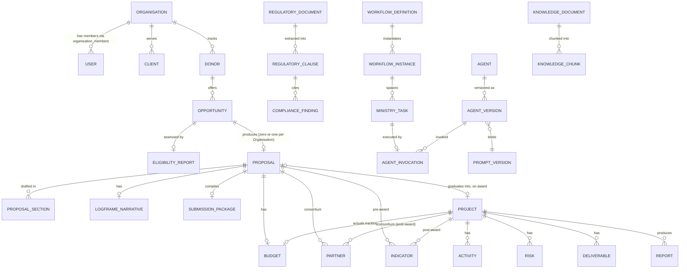

# Domain Model — Specification v1.0

## 0. Purpose and Boundary

EAS §4 lists the platform's core entities and their relationships at
summary level. This document is the full entity dictionary — attributes,
lifecycle states, mutability rules — that every other spec's data contract
must conform to. **This document introduces no new entities and makes no
new business decisions** — it consolidates what EAS §4 and the six specs
that have since defined physical schema (`docs/11-Database-Schema/`, `07-`,
`05-`, `04-`, `03-`, `06-`) already established, into one place a new spec
author or Claude Code can check an entity against before inventing a
seventh definition of "Proposal." Where this document and a physical schema
disagree, `docs/11-Database-Schema/` wins — it is the DDL source of truth
(EAS §4's own framing: "Full schema definition is deferred to
`docs/11-Database-Schema/`; this is the authoritative naming and
relationship layer that schema must conform to").

## 1. Entity-Relationship Overview

This is the relationship shape only — see §2 for the full attribute
dictionary and §3 for lifecycle/mutability rules per entity.

## 2. Entity Dictionary

Physical table names use ADR-0007's mapping where an entity's name differs
from its abstract EAS §4 name (e.g. `Agent` is physically `ai_agents`).

| Entity | Physical table(s) | Key attributes | Owning spec |
|---|---|---|---|
| Organisation | `organisations` | `name` | Database Schema §1 |
| User / Role | `auth.users`, `profiles`, `organisation_members` | `role` (`owner`/`admin`/`member`/`viewer`), `is_platform_operator` | Database Schema §2, Security §2 |
| Donor | `donors` | `donor_status`, `pipeline_stage` (`DFF_Position`), `relationship_owner` | Database Schema §5.2, Grant Studio §2.3 |
| Call / Opportunity | `opportunities` | `cluster`, `tags`, `strategic_narrative`, `risk_score`, `relevance_score`, `version` | Database Schema §5.2, Grant Studio §2.1 |
| Eligibility Report | `eligibility_reports` | five category statuses, `recommendation` | Grant Studio §3.1 |
| Proposal | `proposals` | `stage` (`concept_note`/`full_application`), `version` | Database Schema §5.2 |
| Proposal Section | `proposal_sections` | `section_key`, `content`, `workflow_instance_id` | Database Schema §5.2, Grant Studio §5.1 |
| Logframe (narrative) | `logframe_narratives` | `theory_of_change`, `intervention_logic` (jsonb) | Database Schema §5.3 |
| Indicator | `indicators` | `baseline`, `target`, `actual`, `proposal_id`/`project_id` (dual-scoped) | Database Schema §5.1, Grant Studio §6.1 |
| Budget | `budgets` | `line_items` (jsonb), `indirect_cost_rate`, dual `proposal_id`/`project_id` | Database Schema §5.2, Grant Studio §7.1 |
| Partner | `partners` | `role`, `lef_status`/`fif_status`/`declaration_of_honour_status`, `due_diligence_status`, `performance_rating` | Database Schema §5.2, Grant Studio §4 |
| Submission Package | `submission_packages` | `status`, `compiled_documents` (jsonb) | Grant Studio §10.1 |
| Project (post-award) | `projects` | `stage`, `opportunity_id`, `prag_version`, `budget_total`/`budget_spent` (real, extended) | Database Schema §5.1, Project Operations §3 |
| Activity, Risk, Deliverable | `activities`, `risks`, `deliverables` | (real, live tables, `organisation_id`-extended only) | Project Operations §3 |
| Report | `reports` | `report_type` (extended: adds `interim_narrative`/`final_narrative`) | Database Schema §5.1, Grant Studio §9.1 |
| Regulatory Document | `regulatory_documents` | `category`, `version`, `effective_date`, `jurisdiction` | Regulatory Knowledge Layer §5 |
| Regulatory Clause | `regulatory_clauses` | `section`, `obligation_type`, `extraction_confidence`, `review_status` | Regulatory Knowledge Layer §5 |
| Compliance Finding | `compliance_findings` (append-only) | `artefact_type`/`artefact_id`, `severity`, `status`, `override_justification` | Database Schema §4, Grant Studio §8.1, Security §5 |
| Knowledge Document | `knowledge_documents` | `document_type`, `tags`, `review_status` | Knowledge Platform spec |
| Knowledge Chunk | `knowledge_chunks` | chunk-level embedding | Knowledge Platform spec |
| Workflow Definition | `workflow_definitions` | `states`, `transitions`, `voteOfNoConfidenceThreshold` | Parliament Core §2.6 |
| Workflow Instance | `workflow_instances` | `state`, `history` (jsonb), `voteOfNoConfidenceCount` | Parliament Core §2.6 |
| Ministry Task | (part of workflow instance state, no dedicated table beyond `agent_runs` linkage) | `ministry`, `dependsOn`, `status` | Parliament Core §2.6 |
| Agent | `ai_agents` (real, extended) | `ministry`, `allowedTools` | Parliament Core §3.6, ADR-0007 |
| Agent Version | `prompt_modules` (real, extended) | `approval_state`, `variables`, `test_cases` | Parliament Core §3.6, Platform Services §2 |
| Agent Invocation | `agent_runs` (real, extended) | `tokenCost`, `latencyMs`, `source` (House of Parliament tagging) | Parliament Core §3.6, House of Parliament §9 |
| Memory Entry | `memory_entries` | `tier`, `scope_id`, `confidence`, `justification` | Platform Services §3, House of Parliament §3 |
| Notification Channel/Rule/Log | `notification_channels`, `notification_rules`, `notification_log` | `config_secret_id` (Vault), `delivery_mode` | Platform Services §5, Security §5 |
| Platform Event | `platform_events` | `event_type` | Platform Services §4 |

## 3. Lifecycle States and Mutability

**Append-only, never updated or deleted post-write** (EAS §9 auditability):
`compliance_findings`, `notification_log`, Audit Events / `agent_runs`
history, `workflow_instances.history`. GDPR erasure against these
anonymizes the actor reference; it never deletes the row (Security §7).

**Versioned, insert-only per version** (never mutate `content` in place):
`prompt_modules` (Agent Version) — a new version is always a new row,
exactly one `status = 'active'` per Agent at a time (Platform Services §2.2).

**Entity lifecycle states:**

| Entity | States |
|---|---|
| Opportunity | `open` → `forthcoming`/`rolling` → `closed` → `archived` |
| Proposal | `stage`: `concept_note` → `full_application`; `status`: freeform per Workflow Instance state (not a fixed enum — driven by the Workflow Engine, Parliament Core §2.2) |
| Submission Package | `compiling` → `ready_for_review` → `submitted` (terminal, one-way — Grant Studio §10.1) |
| Workflow Instance | `pending` → `running` → (`awaiting_human` \| `veto_failed` → `rewriting` → `escalated` → `awaiting_human`) → `completed`/`failed`/`cancelled` (Parliament Core §2.2) |
| Agent Version (`prompt_modules`) | `draft` → `pending_review` → `approved` (+ `status: active`) → `deprecated`; rollback re-promotes a deprecated version (Platform Services §2.2) |
| Memory Entry | tier-dependent clearing: `working` TTL-expires on Workflow Instance terminal state or 30 days; `project`/`proposal` archived on closure/award-rejection; `organisation`/`institutional` never automatically cleared (Platform Services §3.1) |
| Compliance Finding | `pass`/`warning`/`fail`/`context_dependent`/`needs_review` — not a lifecycle so much as a point-in-time verdict; a re-check writes a new row, does not update the old one (append-only) |

**Simple mutable records** (standard update semantics, RLS-governed):
`organisations`, `donors`, `partners`, `budgets`, `indicators`,
`proposal_sections`, `projects`, and the real Intelligence-Workspace-origin
tables (`activities`, `risks`, `deliverables`, `clients`).

## 4. Cardinality Notes (beyond the diagram)

- A **Donor** has many **Opportunities**; an **Opportunity** produces
  zero-or-one **Proposal** per Organisation (EAS §4).
- A **Proposal** has exactly one **Budget** and one **Logframe Narrative**,
  but **Partner** and **Indicator** rows are many-per-Proposal.
- An awarded **Proposal** graduates into a **Project** — same underlying
  `Partner`, `Budget`, and `Indicator` rows are re-pointed (`project_id`
  populated), not duplicated (Grant Studio §6.1, §7.1).
- Every **Compliance Finding** references exactly one **Regulatory Clause**
  and exactly one artefact (`artefact_type` + `artefact_id` — polymorphic,
  not a foreign key to a single table, since the artefact type varies:
  proposal, budget, logframe, partner, report).
- Every **Ministry Task** belongs to one **Workflow Instance** and is
  executed by one **Agent Invocation** bound to one **Agent Version**
  (therefore one **Prompt Version** and one model binding).

## 5. Open Items for Product Owner

- None substantive — this document consolidates existing decisions rather
  than raising new ones. If a future spec introduces an entity not listed
  here, that spec should be treated as incomplete until this document is
  updated alongside it (a labelled follow-on, per this project's
  established pattern), not the other way around.
